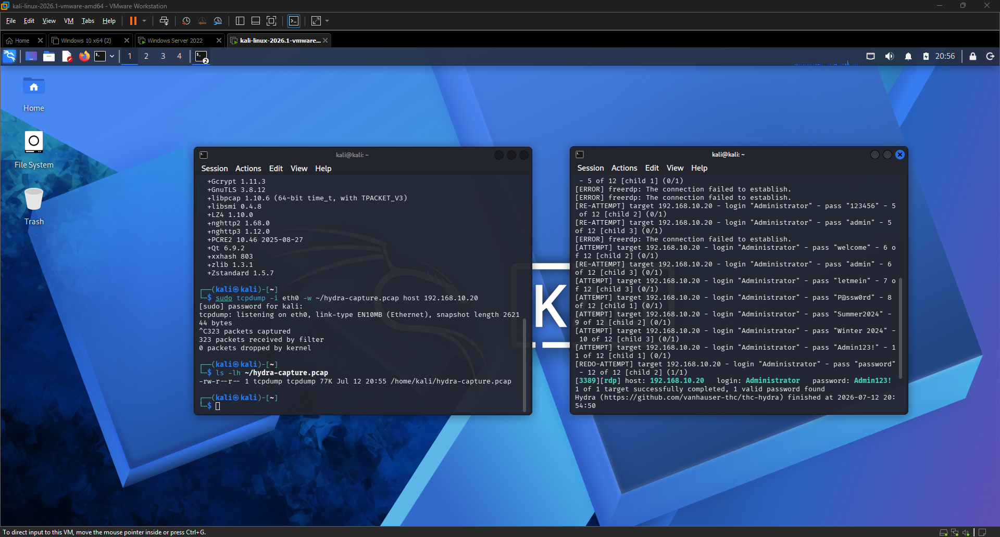
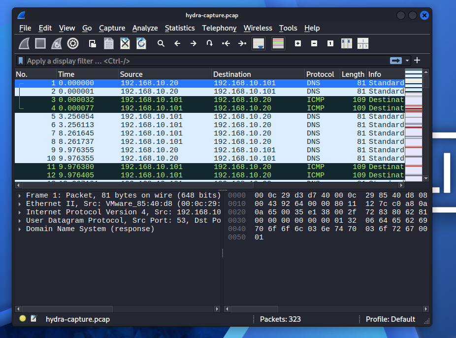
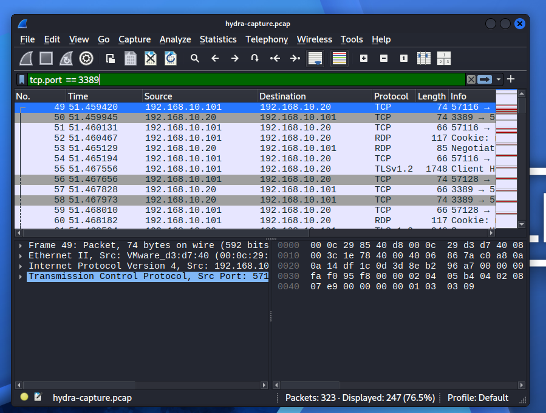
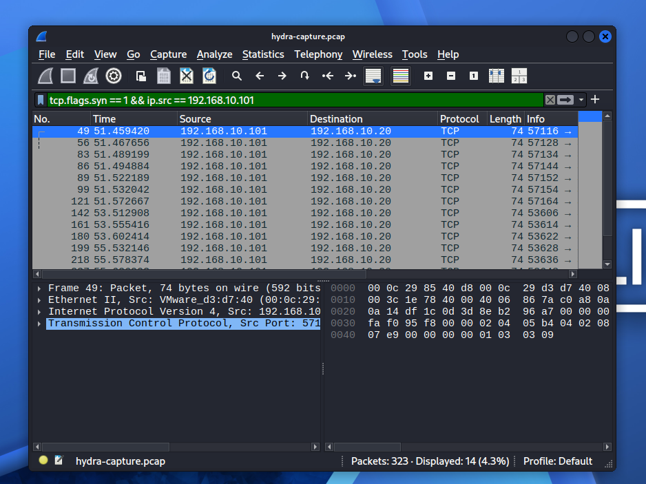
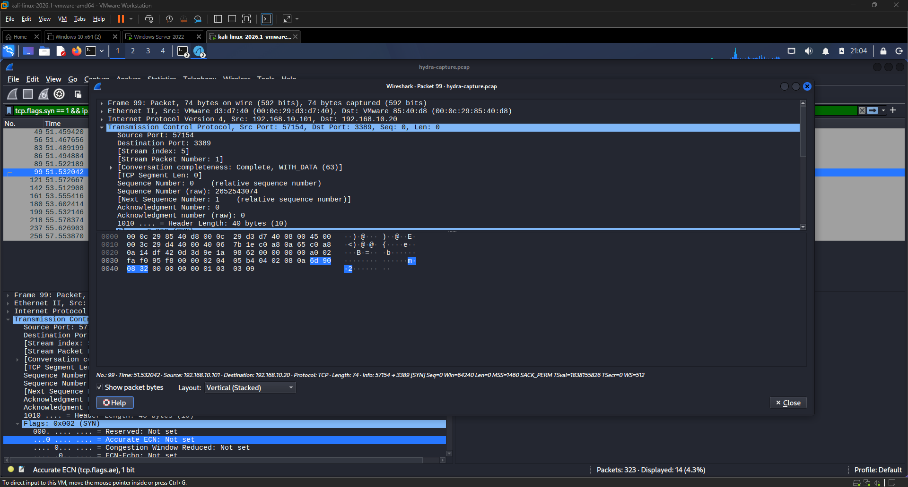

<div align="center">

# 🔬 EXERCISE 04 — WIRESHARK TRAFFIC ANALYSIS


</div>

---

[← Back to README](README.md)

---

## 🖥️ Lab Environment

| Component | Details |
|-----------|---------|
| Attacker VM | Kali Linux 2026.1 |
| Defender VM | Windows Server 2022 Standard |
| Attacker IP | 192.168.10.101 |
| Defender IP | 192.168.10.20 |
| Network | LAN Segment (labnetwork) — isolated |
| Tools Used | tcpdump, Wireshark |
| Capture File | hydra-capture.pcap |
| Total Packets | 323 |

---

## 📋 Background

Wireshark is the industry standard tool for network packet capture and analysis. It allows a defender to see exactly what is happening on the wire, every connection attempt, every protocol handshake, and every data exchange between systems. In a SOC environment, PCAP analysis is used to investigate incidents, confirm attacker behavior, and build a detailed timeline of what happened during an attack.

In this exercise I used tcpdump to capture all network traffic during a live Hydra RDP brute force attack, then loaded the capture file into Wireshark to analyze what the attack looked like on the wire. This exercise builds on Exercise 03 by showing the network-level evidence of the same attack that generated Event ID 4625 entries in the Windows Security log.

---

## 🎯 Objectives

- Capture live network traffic during an active attack
- Analyze a PCAP file in Wireshark
- Identify RDP brute force patterns in network traffic
- Understand TCP handshake behavior during repeated connection attempts
- Correlate network evidence with Windows Event Log evidence from Exercise 03

---

## ⚔️ Phase 1 — Traffic Capture

### Step 1 — I Started tcpdump on Kali

I opened two terminal windows on Kali Linux. In the first terminal I started a packet capture targeting all traffic to and from the Windows Server IP.

**Command:**
```bash
sudo tcpdump -i eth0 -w ~/hydra-capture.pcap host 192.168.10.20
```

**Flags used:**

| Flag | Purpose |
|------|---------|
| `-i eth0` | Capture on the eth0 network interface |
| `-w ~/hydra-capture.pcap` | Write capture to file |
| `host 192.168.10.20` | Only capture traffic to or from Windows Server |

tcpdump began listening silently with no output — this is normal behavior when writing to a file.

### Step 2 — I Re-ran the Hydra Attack

In the second terminal I ran the same Hydra RDP brute force attack from Exercise 03 while tcpdump was capturing in the background.

**Command:**
```bash
hydra -l Administrator -P ~/passwords.txt rdp://192.168.10.20 -V -f
```

Hydra ran through all 12 password attempts and successfully found the correct credential: `Admin123!`

### Step 3 — I Stopped the Capture and Verified the File

After Hydra completed I pressed Ctrl+C in the first terminal to stop tcpdump.

**Result:**
```
323 packets captured
323 packets received by filter
0 packets dropped by kernel
```

**Verified the file was saved:**
```bash
ls -lh ~/hydra-capture.pcap
```

**Output:**
```
-rw-r--r-- 1 tcpdump 77K Jul 12 20:55 /home/kali/hydra-capture.pcap
```

A 77KB PCAP file containing 323 packets was successfully saved.

---

## 🔬 Phase 2 — Wireshark Analysis

### Step 1 — I Opened the Capture in Wireshark

```bash
sudo wireshark ~/hydra-capture.pcap
```

Wireshark loaded all 323 packets showing traffic between 192.168.10.101 (Kali) and 192.168.10.20 (Windows Server). The packet list showed a mix of DNS, ICMP, TCP, RDP, and TLSv1.2 traffic.

---

### Step 2 — I Filtered for RDP Traffic

I applied a display filter to isolate only traffic on port 3389 (RDP).

**Filter:**
```
tcp.port == 3389
```

**Result:** 247 of 323 packets (76.5%) were RDP traffic — confirming the attack was heavily focused on port 3389. The packet list showed repeated TCP and RDP protocol exchanges between the two machines along with TLSv1.2 negotiation attempts.

---

### Step 3 — I Filtered for SYN Packets from the Attacker

I applied a filter to isolate only the TCP SYN packets originating from the attacker — these represent the start of each new connection attempt Hydra made.

**Filter:**
```
tcp.flags.syn == 1 && ip.src == 192.168.10.101
```

**Result:** 14 SYN packets were displayed — each one representing a separate connection Hydra initiated to Windows Server on port 3389. This matches the number of connection attempts Hydra made during the attack.

---

### Step 4 — I Inspected a Single SYN Packet

I clicked on packet 99 to inspect the full TCP handshake details. The expanded Transmission Control Protocol section revealed:

| Field | Value |
|-------|-------|
| Source IP | 192.168.10.101 |
| Destination IP | 192.168.10.20 |
| Source Port | 57154 |
| Destination Port | 3389 |
| Flags | 0x002 (SYN) |
| Sequence Number | 0 |
| TCP Segment Length | 0 |

The SYN flag confirms this is the first packet of a TCP three-way handshake — Hydra initiating a new connection to RDP. Each failed password attempt generated a new SYN packet as Hydra reset the connection and tried again.

---

## 🔑 Key Findings

1. **323 total packets** were captured during the Hydra attack — 247 (76.5%) were RDP traffic on port 3389
2. **14 SYN packets** from the attacker IP confirm 14 separate connection attempts to RDP
3. **Repeated connection resets** are visible in the traffic — a pattern unique to brute force tools
4. **TLSv1.2 negotiation** appears in the traffic showing Hydra attempted to establish encrypted RDP sessions
5. **Network evidence correlates with log evidence** — the same attack that generated 20 x Event ID 4625 entries in Windows Event Viewer is clearly visible as repeated TCP SYN packets in Wireshark

---

## 🔗 Correlation with Exercise 03

| Evidence Type | Exercise 03 (Event Logs) | Exercise 04 (Wireshark) |
|---------------|--------------------------|-------------------------|
| Attack tool | Hydra | Hydra |
| Attacker IP | 192.168.10.101 | 192.168.10.101 |
| Target | 192.168.10.20 | 192.168.10.20 |
| Port | 3389 (RDP) | 3389 (RDP) |
| Evidence | 20 x Event ID 4625 | 14 SYN packets + 247 RDP packets |
| Timestamp | 7/12/2026 5:27 PM | 7/12/2026 8:55 PM |

Both sources confirm the same attack from the same attacker. In a real SOC investigation, correlating log evidence with PCAP evidence gives a complete picture of what happened.

---

## 🛡️ Defender Takeaways

- Network traffic analysis can confirm an attack even when log evidence is incomplete
- Repeated SYN packets to port 3389 from a single source IP in a short time window is a clear brute force indicator
- A SIEM with network monitoring would alert on this pattern automatically
- PCAP files are critical evidence in incident response — always preserve them

---

## 📟 Commands Reference

| Command | Purpose |
|---------|---------|
| `sudo tcpdump -i eth0 -w ~/hydra-capture.pcap host 192.168.10.20` | Capture traffic to/from Windows Server |
| `ls -lh ~/hydra-capture.pcap` | Verify capture file was saved |
| `sudo wireshark ~/hydra-capture.pcap` | Open capture in Wireshark |
| `tcp.port == 3389` | Wireshark filter — show only RDP traffic |
| `tcp.flags.syn == 1 && ip.src == 192.168.10.101` | Wireshark filter — show SYN packets from attacker |

---

## 💡 Lessons Learned

- tcpdump is a lightweight command-line tool that can capture traffic without a GUI — essential for headless servers
- Wireshark display filters allow a defender to quickly isolate attack traffic from normal traffic
- Brute force attacks have a recognizable network signature — repeated SYN packets followed by connection resets
- PCAP analysis and log analysis together give a complete picture of an attack
- Preserving PCAP files during an incident is critical — they are forensic evidence

---

## 📸 Screenshots

| Screenshot | Description |
|------------|-------------|
|  | Both terminals — tcpdump capture stats and file verification |
|  | Wireshark loaded with 323 packets from hydra-capture.pcap |
|  | Wireshark filtered for tcp.port == 3389 showing 247 RDP packets |
|  | Wireshark filtered for SYN packets from attacker IP |
|  | Single SYN packet expanded showing TCP handshake details |
