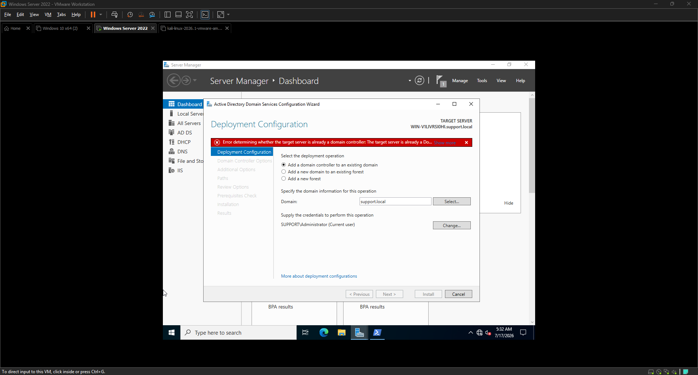
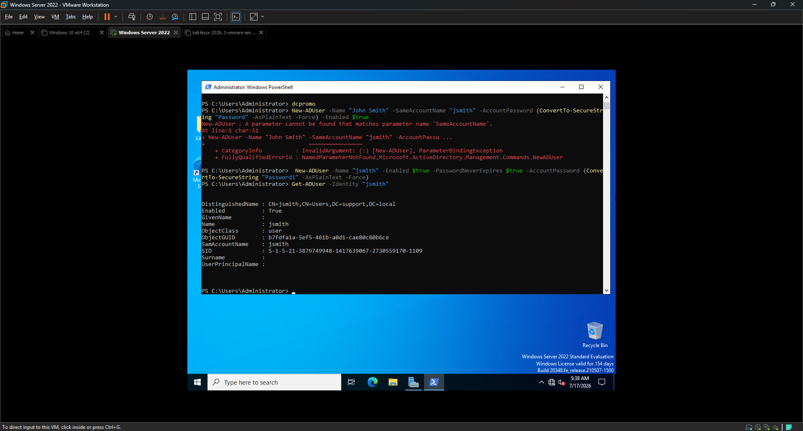
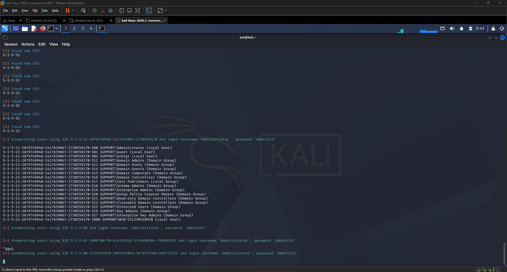
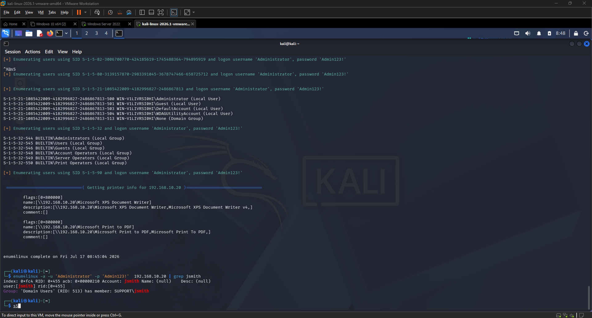
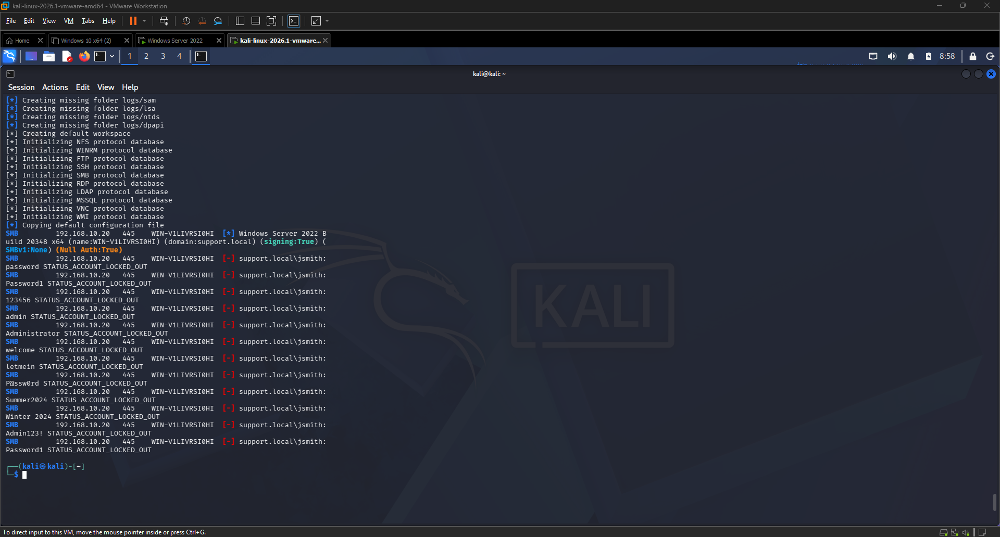
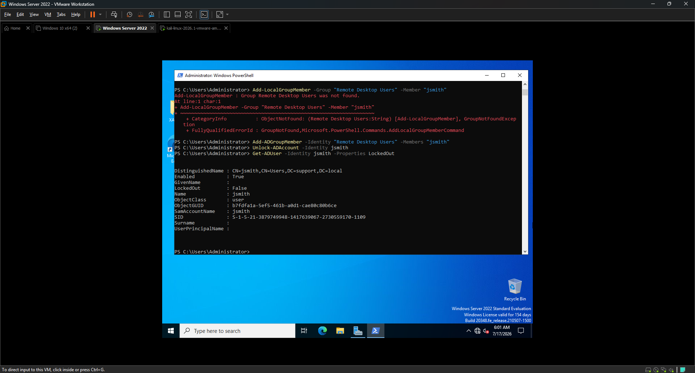
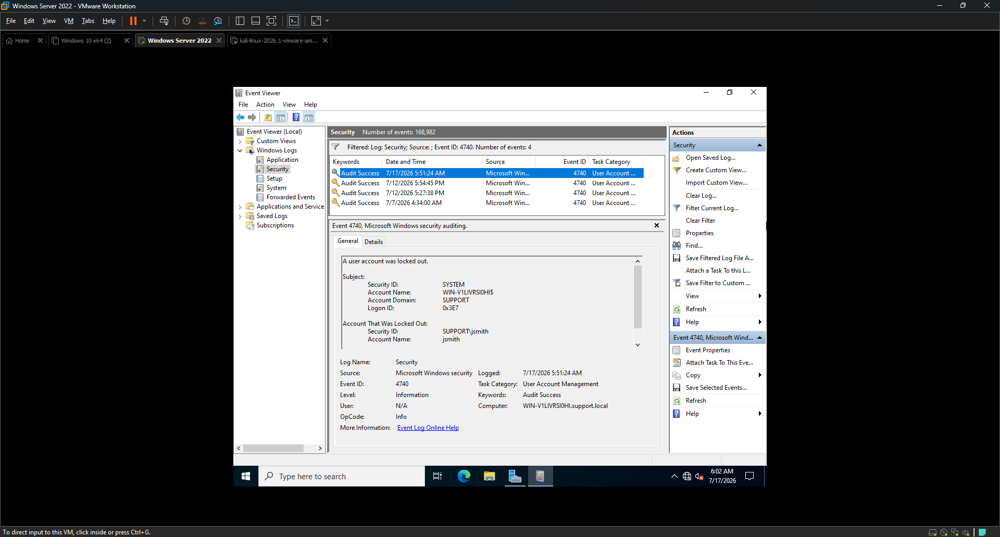

<div align="center">

# 🏰 EXERCISE 05 — ACTIVE DIRECTORY ATTACK AND DEFEND


</div>

---

[← Back to README](README.md)

---

## 🖥️ Lab Environment

| Component | Details |
|-----------|---------|
| Attacker VM | Kali Linux 2026.1 |
| Defender VM | Windows Server 2022 Standard |
| Domain | support.local |
| Domain Controller | WIN-V1LIVRSI0HI.support.local |
| Attacker IP | 192.168.10.101 |
| Defender IP | 192.168.10.20 |
| Network | LAN Segment (labnetwork) — isolated |
| Tools Used | enum4linux, netexec, PowerShell, Event Viewer |

---

## 📋 Background

Active Directory (AD) is the backbone of enterprise identity management. It controls who can log in, what they can access, and how systems communicate across a Windows domain. Because of this, AD is one of the most targeted attack surfaces in real-world breaches. Attackers typically follow a pattern: enumerate the domain to discover users and groups, then brute force or spray credentials to gain access.

In this exercise I acted as the attacker first, using `enum4linux` to enumerate the `support.local` domain and discover user accounts, then used `netexec` to attempt credential attacks against a domain user account. I then switched to the defender role and investigated the resulting lockout events in Windows Event Viewer, documenting the full attack and defense cycle.

---

## 🎯 Lab Objectives

- Confirm Active Directory is configured and the domain is active
- Create a vulnerable domain user account for attack simulation
- Use enum4linux to enumerate domain users, groups, and SIDs from Kali
- Use netexec to perform a credential attack against a domain user
- Detect the account lockout in Windows Security Event Logs
- Unlock the account and document defender findings

---

## ⚙️ Phase 1 — Environment Verification

### Step 1 — Confirmed Domain Controller is Active

I opened Server Manager on Windows Server 2022 and confirmed the domain `support.local` was active. The Deployment Configuration Wizard showed the server was already promoted as a domain controller with `SUPPORT\Administrator` as the current user.

The domain `support.local` was established during previous IT Support Home Lab work and was ready for use in this exercise.

---

### Step 2 — Created a Vulnerable Domain User

I opened PowerShell as Administrator on Windows Server and created a new domain user `jsmith` with a weak password to simulate a real-world vulnerable account.

**Command:**
```powershell
New-ADUser -Name "jsmith" -Enabled $true -PasswordNeverExpires $true -AccountPassword (ConvertTo-SecureString "Password1" -AsPlainText -Force)
```

**Verified the user was created:**
```powershell
Get-ADUser -Identity "jsmith"
```

**Result:**
```
DistinguishedName : CN=jsmith,CN=Users,DC=support,DC=local
Enabled           : True
Name              : jsmith
ObjectClass       : user
SamAccountName    : jsmith
SID               : S-1-5-21-3879749948-1417639067-2730559170-1109
```

User `jsmith` confirmed active in the `support.local` domain.

---

## ⚔️ Phase 2 — Attacker Phase

### Step 3 — Domain Enumeration with enum4linux

I switched to Kali Linux and ran `enum4linux` with Administrator credentials to enumerate the full domain — users, groups, SIDs, and shares.

**Command:**
```bash
enum4linux -a -u 'Administrator' -p 'Admin123!' 192.168.10.20
```

**Key findings from enumeration:**

| Item | Details |
|------|---------|
| Domain | SUPPORT |
| Domain Controller | WIN-V1LIVRSI0HI |
| Users discovered | Administrator, Guest, krbtgt, jsmith |
| Groups discovered | Domain Admins, Domain Users, Domain Controllers, Enterprise Admins, Schema Admins |
| SMB Signing | True — required |
| Null Auth | True |

**jsmith specifically identified:**
```
user:[jsmith] rid:[0x455]
Group: 'Domain Users' (RID: 513) has member: SUPPORT\jsmith
```

As an attacker, discovering `jsmith` in `Domain Users` with a RID of 1109 gives a clear target for credential attacks.

---

### Step 4 — Credential Attack with netexec

I used `netexec` (the updated version of crackmapexec) to perform a password spray attack against `jsmith` using my wordlist.

**Command:**
```bash
netexec smb 192.168.10.20 -u jsmith -p ~/passwords.txt
```

**Result:**
```
SMB    192.168.10.20  445  WIN-V1LIVRSI0HI  [-] support.local\jsmith: password STATUS_ACCOUNT_LOCKED_OUT
SMB    192.168.10.20  445  WIN-V1LIVRSI0HI  [-] support.local\jsmith: Password1 STATUS_ACCOUNT_LOCKED_OUT
SMB    192.168.10.20  445  WIN-V1LIVRSI0HI  [-] support.local\jsmith: 123456 STATUS_ACCOUNT_LOCKED_OUT
...
```

Every attempt returned `STATUS_ACCOUNT_LOCKED_OUT` — the domain account lockout policy triggered after repeated failed attempts, locking `jsmith` out before the correct password could be found. This is the account lockout policy working exactly as intended.

---

## 🛡️ Phase 3 — Defender Phase

### Step 5 — Detected Account Lockout in Event Viewer

I switched to Windows Server and opened Event Viewer. I filtered the Security log for **Event ID 4740** — the Windows event generated when a user account is locked out.

**Filter:** Event ID 4740

**Result:** 4 lockout events were found. The most recent was logged at **7/17/2026 5:51:24 AM** — exactly matching the time netexec ran the attack.

**Event details:**
| Field | Value |
|-------|-------|
| Event ID | 4740 |
| Description | A user account was locked out |
| Account Locked Out | SUPPORT\jsmith |
| Security ID | WIN-V1LIVRSI0HI$ |
| Account Domain | SUPPORT |
| Logged | 7/17/2026 5:51:24 AM |
| Computer | WIN-V1LIVRSI0HI.support.local |

A SOC analyst monitoring these logs in real time would immediately see the 4740 event, identify `jsmith` as the target, investigate the source, and block the attacker before any access was gained.

---

### Step 6 — Unlocked the Account

After documenting the lockout I unlocked the `jsmith` account using PowerShell.

**Command:**
```powershell
Unlock-ADAccount -Identity jsmith
```

**Verified the account was unlocked:**
```powershell
Get-ADUser -Identity jsmith -Properties LockedOut
```

**Result:**
```
LockedOut : False
Enabled   : True
Name      : jsmith
```

Account successfully unlocked and restored to normal state.

---

## ✅ Result

I successfully completed a full Active Directory attack and defense cycle. As the attacker I used `enum4linux` to enumerate the `support.local` domain and discovered the `jsmith` account. I then used `netexec` to launch a credential attack. The domain's account lockout policy automatically blocked the attack by locking `jsmith` after repeated failed attempts. As the defender I detected the lockout via Event ID 4740 in the Windows Security log, confirmed the attacker behavior, and unlocked the account. The lockout policy prevented any successful unauthorized access.

---

## 🔒 Recommended Defensive Measures

| Defense | How It Helps |
|---------|-------------|
| Account Lockout Policy | Automatically locks accounts after failed attempts — stops brute force and spray attacks |
| Disable null sessions | Prevents anonymous enumeration of domain users and groups |
| Restrict SMB access | Limit SMB to trusted IPs only — stops remote enumeration tools |
| Monitor Event ID 4740 | Alert on any account lockout — immediate indicator of attack |
| Monitor Event ID 4625 | Alert on failed logons — catch attacks before lockout triggers |
| Strong password policy | Makes credential attacks harder even if enumeration succeeds |
| Privileged Access Workstations | Limit where admin accounts can authenticate from |
| Disable default accounts | Rename or disable default Administrator and Guest accounts |

---

## 📟 Commands Reference

| Command | Purpose |
|---------|---------|
| `Get-ADUser -Identity "jsmith"` | Verify AD user exists |
| `New-ADUser -Name "jsmith" -Enabled $true ...` | Create domain user |
| `Unlock-ADAccount -Identity jsmith` | Unlock locked AD account |
| `Get-ADUser -Identity jsmith -Properties LockedOut` | Check lockout status |
| `enum4linux -a -u 'Administrator' -p 'Admin123!' 192.168.10.20` | Full domain enumeration |
| `netexec smb 192.168.10.20 -u jsmith -p ~/passwords.txt` | SMB credential attack |

---

## 💡 Lessons Learned

- Active Directory enumeration gives attackers a complete map of the domain before they attempt a single login
- `enum4linux` can discover usernames, group memberships, SIDs, and shares — all without triggering a single failed logon event
- Account lockout policies are one of the most effective controls against credential attacks — they automatically stop brute force and spray attacks
- Event ID 4740 is the primary detection mechanism for account lockout — every SOC should alert on it
- A single 4740 event could be a user forgetting their password — multiple 4740 events in a short window is almost certainly an attack
- Attackers who know the lockout threshold will slow their attacks to stay below it — which is why monitoring 4625 events is also critical
- Disabling null sessions removes the easiest path for unauthenticated domain enumeration

---

## 📸 Screenshots

| Screenshot | Description |
|------------|-------------|
|  | Server Manager showing domain support.local active and configured |
|  | PowerShell confirming jsmith created in support.local domain |
|  | enum4linux full domain enumeration showing all users and groups |
|  | jsmith discovered via enum4linux grep — user and group membership |
|  | netexec showing STATUS_ACCOUNT_LOCKED_OUT on all attempts |
|  | PowerShell showing LockedOut: False after Unlock-ADAccount |
|  | Event ID 4740 showing SUPPORT\jsmith locked out at 5:51 AM |
