<div align="center">

# 🛡️ EXERCISE 06 — HOME SIEM WITH WAZUH


</div>

---

[← Back to README](README.md)

---

## 🖥️ Lab Environment

| Component | Details |
|-----------|---------|
| SIEM Platform | Wazuh v4.7.0 |
| Deployment Method | Docker (single-node) on Kali Linux |
| Wazuh Manager IP | 192.168.10.101 (Kali Linux) |
| Agent | Windows Server 2022 — WinServer2022 |
| Agent IP | 192.168.10.20 |
| Network | LAN Segment (labnetwork) — isolated |
| Dashboard | https://localhost (port 443) |

---

## 📋 Background

A Security Information and Event Management (SIEM) system is the central nervous system of a Security Operations Center. It collects logs and security events from across an environment, correlates them against detection rules, and generates alerts when suspicious activity is detected. Wazuh is an open source SIEM and XDR platform used in real SOC environments around the world.

In this exercise I deployed Wazuh using Docker on Kali Linux, connected Windows Server 2022 as a monitored agent, and generated real security alerts by running attack techniques from previous exercises — Nmap scanning and Hydra brute force. This exercise demonstrates how a SOC analyst uses a SIEM to detect attacks in real time across an environment.

---

## 🎯 Lab Objectives

- Deploy Wazuh SIEM using Docker on Kali Linux
- Access the Wazuh web dashboard
- Register Windows Server 2022 as a Wazuh agent
- Generate security events using Nmap and Hydra
- Analyze real-time alerts in the Wazuh dashboard
- Identify attack patterns using MITRE ATT&CK mapping

---

## ⚙️ Phase 1 — Wazuh Deployment

### Step 1 — Installed Docker

I temporarily switched Kali's network adapter to NAT to get internet access, then installed Docker.

**Commands:**
```bash
sudo apt update && sudo apt install -y docker.io
sudo systemctl start docker
sudo systemctl enable docker
docker --version
```

**Result:** Docker version 28.5.2 installed and running.

---

### Step 2 — Cloned the Wazuh Docker Repository

```bash
sudo apt install -y git
git clone https://github.com/wazuh/wazuh-docker.git -b v4.7.0
cd wazuh-docker/single-node
```

---

### Step 3 — Generated SSL Certificates

```bash
sudo docker-compose -f generate-indexer-certs.yml run --rm generator
```

SSL certificates generated successfully for secure Wazuh communication.

---

### Step 4 — Started Wazuh

```bash
sudo docker-compose up -d
```

Three containers started:
- `single-node-wazuh.manager-1` — the Wazuh manager
- `single-node-wazuh.indexer-1` — the data indexer
- `single-node-wazuh.dashboard-1` — the web dashboard

---

### Step 5 — Accessed the Wazuh Dashboard

After containers fully initialized I opened Firefox in Kali and navigated to:

```
https://localhost/app/login
```

Accepted the self-signed SSL certificate warning and logged in with default credentials:

| Field | Value |
|-------|-------|
| Username | admin |
| Password | SecretPassword |

The Wazuh dashboard loaded successfully showing the main overview.

---

## 🔌 Phase 2 — Agent Registration

### Step 6 — Downloaded and Installed Wazuh Agent on Windows Server

I temporarily switched Windows Server's network adapter to NAT and downloaded the Wazuh Windows agent directly:

```
https://packages.wazuh.com/4.x/windows/wazuh-agent-4.7.0-1.msi
```

Installed the MSI and opened the Wazuh Agent Manager, entering the manager IP `192.168.10.101`.

---

### Step 7 — Registered the Agent

I switched both VMs back to LAN Segment and set static IPs:

**Kali:**
```bash
sudo ifconfig eth0 192.168.10.101 netmask 255.255.255.0 up
```

**Windows Server:**
```cmd
netsh interface ip set address "Ethernet0" static 192.168.10.20 255.255.255.0
```

I then registered the agent using the agent-auth tool on Windows Server:

```powershell
& 'C:\Program Files (x86)\ossec-agent\agent-auth.exe' -m 192.168.10.101
```

**Result:** `Valid key received` — agent successfully registered with the Wazuh manager.

---

### Step 8 — Started the Wazuh Agent Service

```cmd
NET START WazuhSvc
```

The Wazuh agent service started and connected to the manager. The WinServer2022 agent appeared in the Wazuh dashboard under Agents showing Security Events, MITRE ATT&CK, and Compliance sections.

---

## 🔍 Phase 3 — Alert Generation and Analysis

### Step 9 — Generated Alerts with Nmap

I ran an Nmap scan from Kali against Windows Server while Wazuh monitored the traffic:

```bash
nmap 192.168.10.20
```

**Wazuh detected:** Defense Evasion and Persistence alerts triggered — Wazuh's detection rules identified the reconnaissance activity and mapped it to MITRE ATT&CK techniques in real time.

---

### Step 10 — Generated Alerts with Hydra Brute Force

I ran the Hydra RDP brute force attack from Exercise 03:

```bash
hydra -l Administrator -P ~/passwords.txt rdp://192.168.10.20 -V -f
```

**Wazuh detected:** Multiple Login Failure alerts generated — Wazuh identified the repeated failed authentication attempts and raised alerts with severity levels and MITRE ATT&CK mapping.

---

## ✅ Result

I successfully deployed a fully functional home SIEM using Wazuh, connected Windows Server 2022 as a monitored agent, and confirmed real-time detection of attack techniques. Wazuh detected both the Nmap reconnaissance scan and the Hydra brute force attack, generating alerts with MITRE ATT&CK context. This demonstrates the core workflow of a SOC analyst — attacks happen, the SIEM catches them, and the analyst investigates.

---

## 🔑 Key Findings

| Attack | Wazuh Detection | MITRE Mapping |
|--------|----------------|---------------|
| Nmap scan | Defense Evasion / Persistence alerts | TA0005, TA0003 |
| Hydra brute force | Login Failure alerts | T1110 — Brute Force |
| Agent connectivity | Real-time event ingestion confirmed | — |

---

## 💡 Key Takeaways

- Wazuh is a production-grade open source SIEM used in real SOC environments — the same concepts apply at enterprise scale
- Docker makes SIEM deployment fast — the same Wazuh stack can be deployed on a cloud VM in minutes
- SIEM agents collect logs and forward them to the manager automatically — once deployed, detection is continuous
- Wazuh maps alerts to MITRE ATT&CK techniques — giving analysts immediate context about what the attacker is trying to do
- Real-time detection is the goal — the faster an attack is detected, the less damage it causes
- A SIEM alone doesn't stop attacks — it detects them. The analyst must investigate and respond

---

## 📟 Commands Reference

| Command | Purpose |
|---------|---------|
| `sudo apt install -y docker.io` | Install Docker on Kali |
| `sudo systemctl start docker` | Start Docker service |
| `git clone https://github.com/wazuh/wazuh-docker.git -b v4.7.0` | Download Wazuh Docker files |
| `sudo docker-compose -f generate-indexer-certs.yml run --rm generator` | Generate SSL certificates |
| `sudo docker-compose up -d` | Start Wazuh in background |
| `sudo docker ps` | Verify containers are running |
| `sudo ifconfig eth0 192.168.10.101 netmask 255.255.255.0 up` | Set Kali static IP |
| `& 'C:\Program Files (x86)\ossec-agent\agent-auth.exe' -m 192.168.10.101` | Register Windows agent |
| `NET START WazuhSvc` | Start Wazuh agent service on Windows |
| `nmap 192.168.10.20` | Generate Nmap alerts |
| `hydra -l Administrator -P ~/passwords.txt rdp://192.168.10.20 -V -f` | Generate brute force alerts |

---

## 📸 Screenshots

| Screenshot | Description |
|------------|-------------|
| 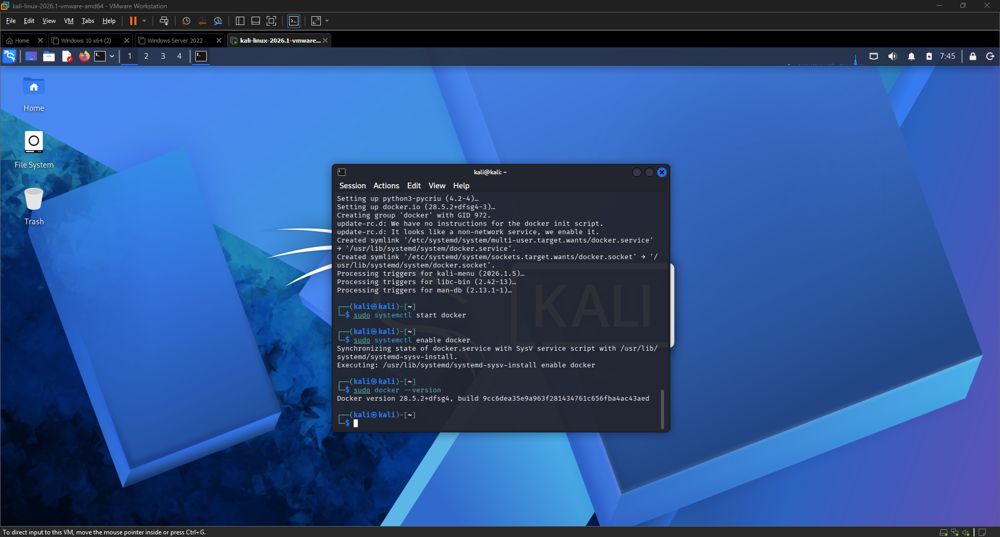 | Docker version 28.5.2 installed and verified |
| 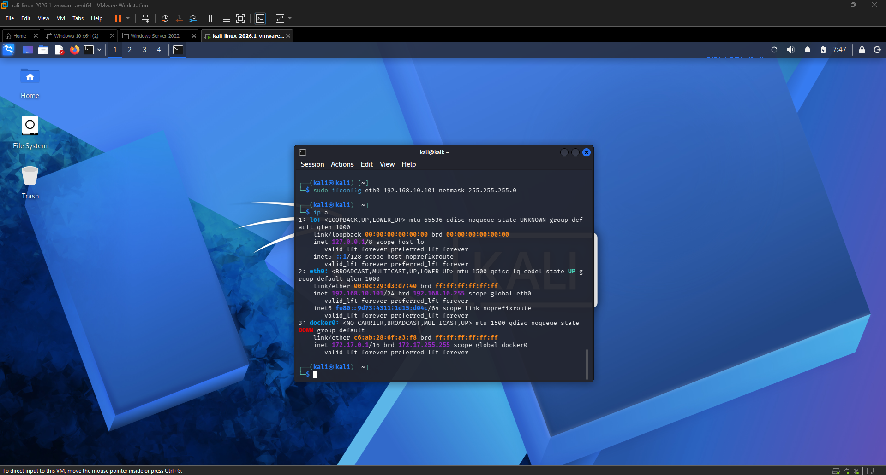 | Inside wazuh-docker/single-node directory |
|  | Git installed on Kali |
| 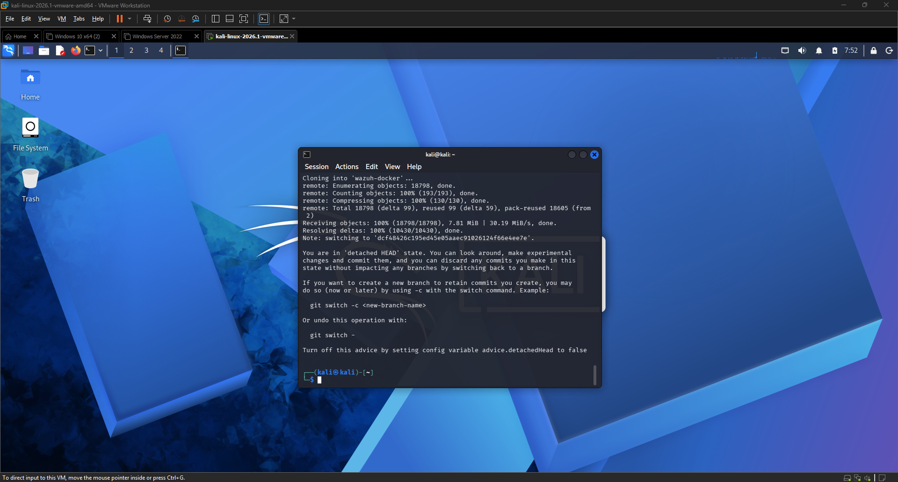 | Wazuh Docker repo cloned successfully |
| 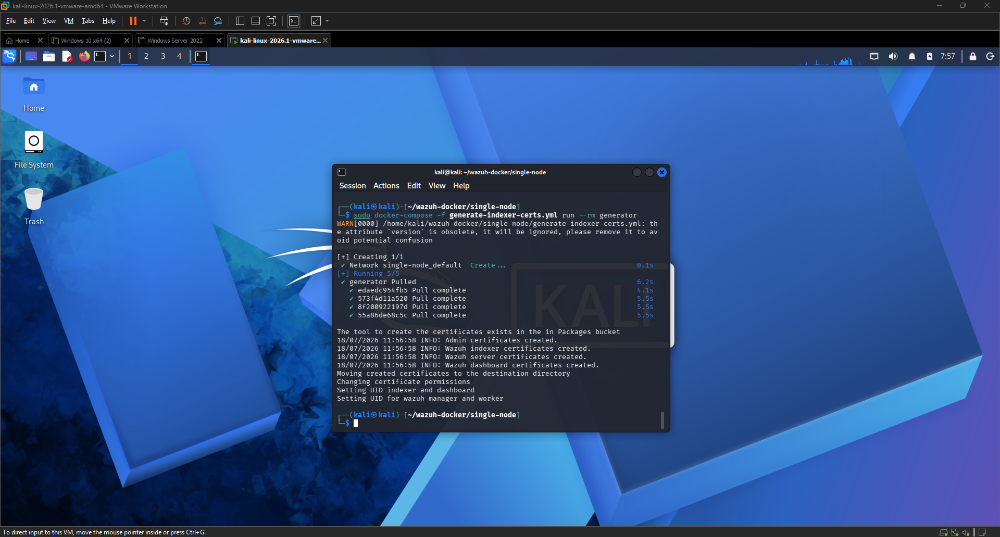 | SSL certificates generated |
| 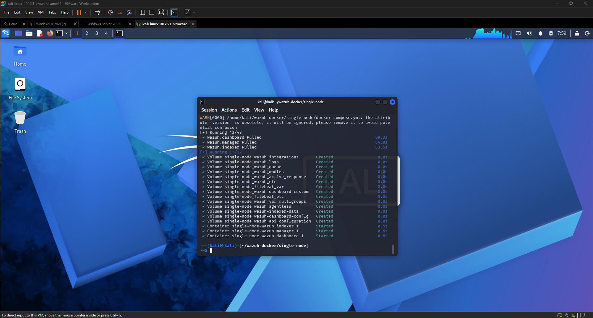 | docker-compose up completed — all containers started |
| 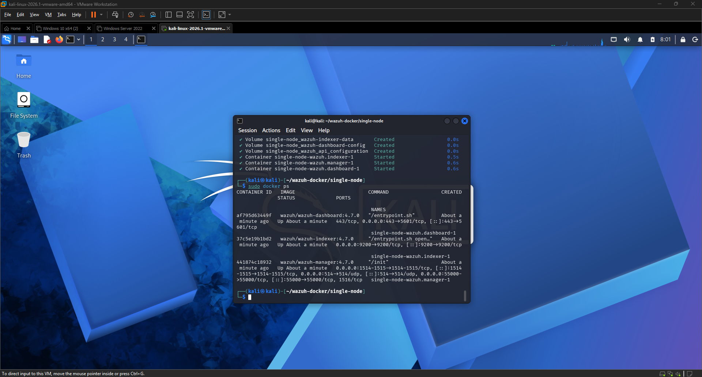 | docker ps showing all three containers running |
| 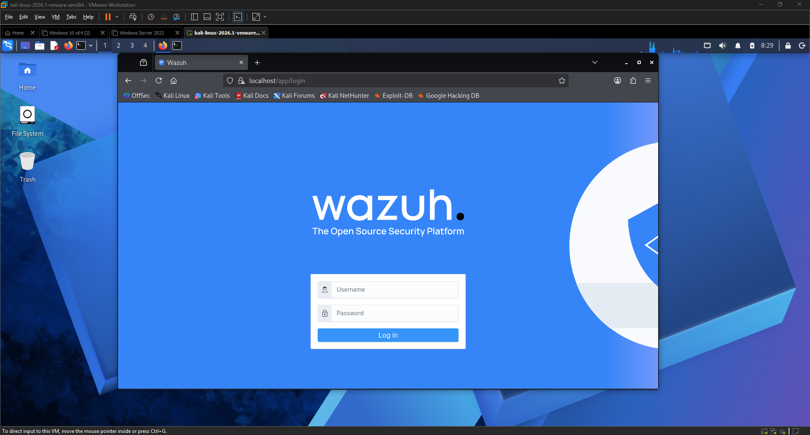 | Wazuh login page in Firefox |
| 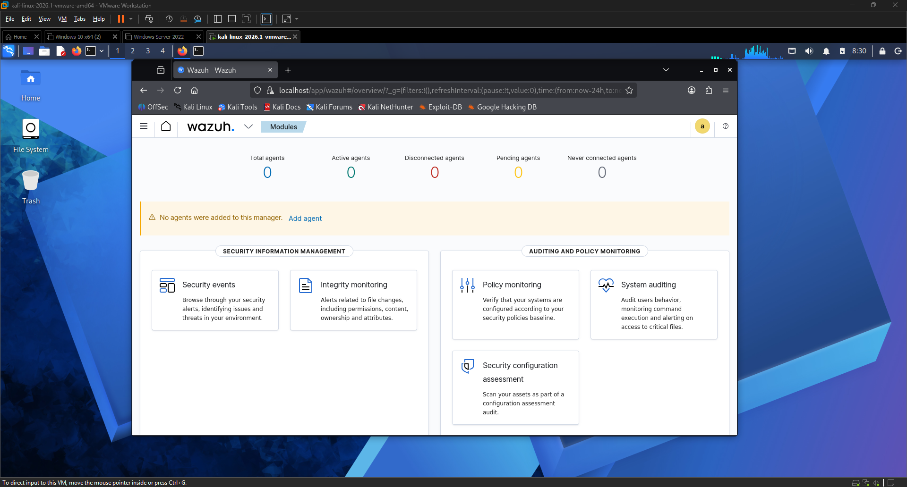 | Wazuh dashboard after successful login |
| 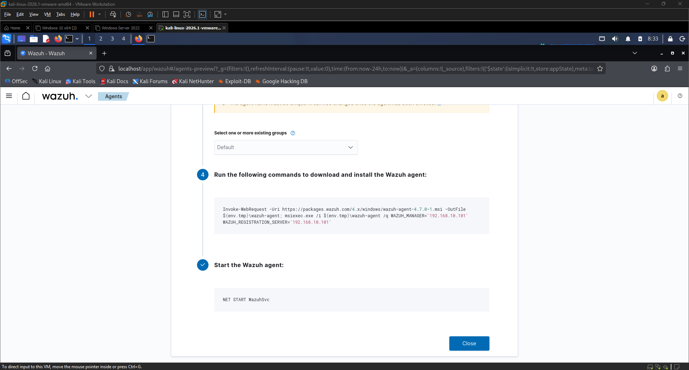 | Deploy new agent page showing install command |
| 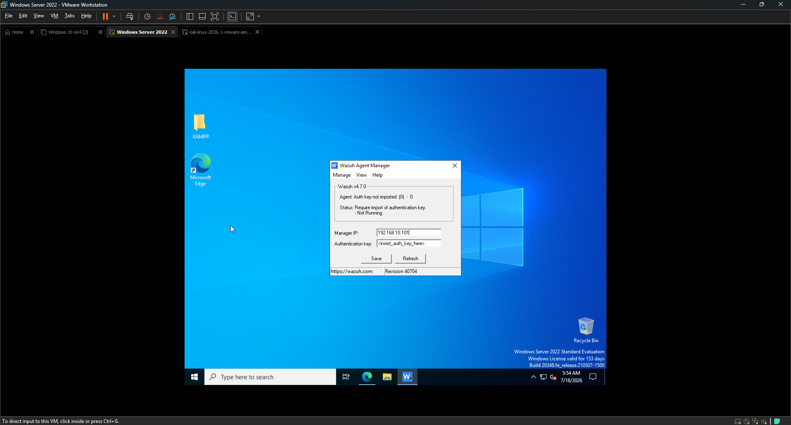 | Wazuh Agent Manager on Windows Server with manager IP entered |
| 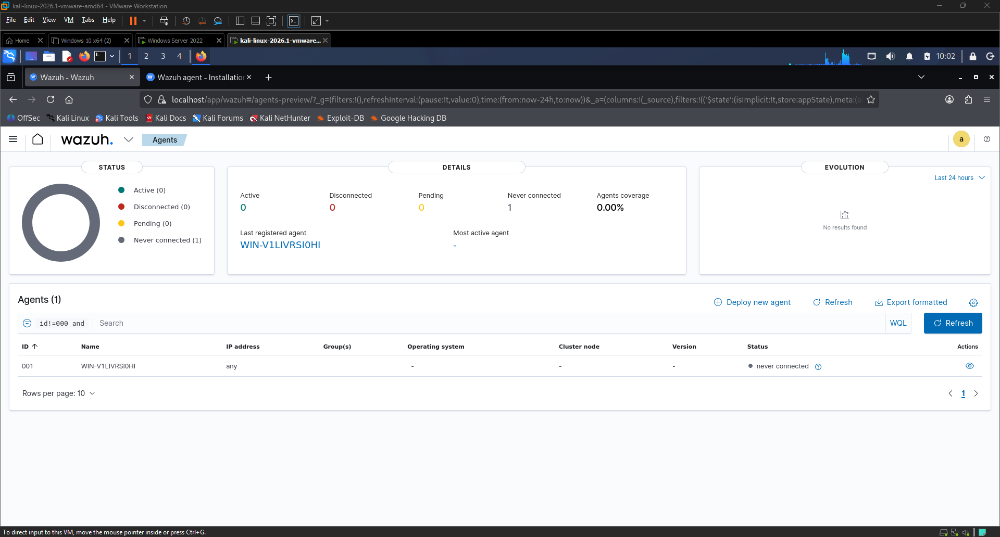 | WinServer2022 agent showing as connected in dashboard |
| 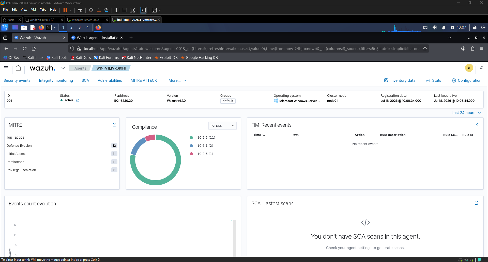 | Agent overview showing Security Events, MITRE, and Compliance |
| 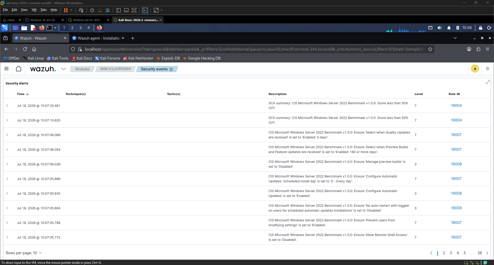 | Security events table showing live alerts from Windows Server |
| 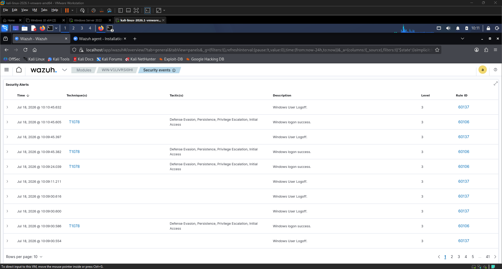 | Wazuh alerts triggered by Nmap scan — Defense Evasion detected |
| 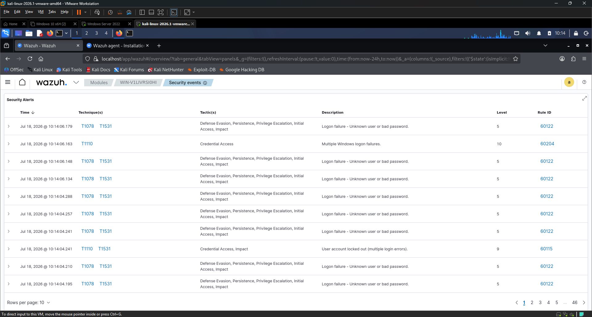 | Wazuh alerts triggered by Hydra — Login Failure alerts detected |
