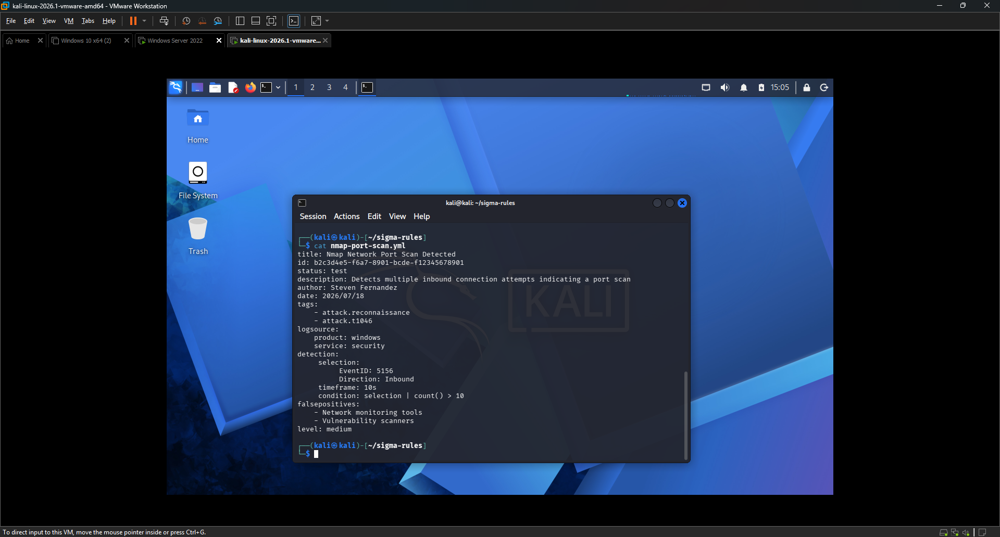
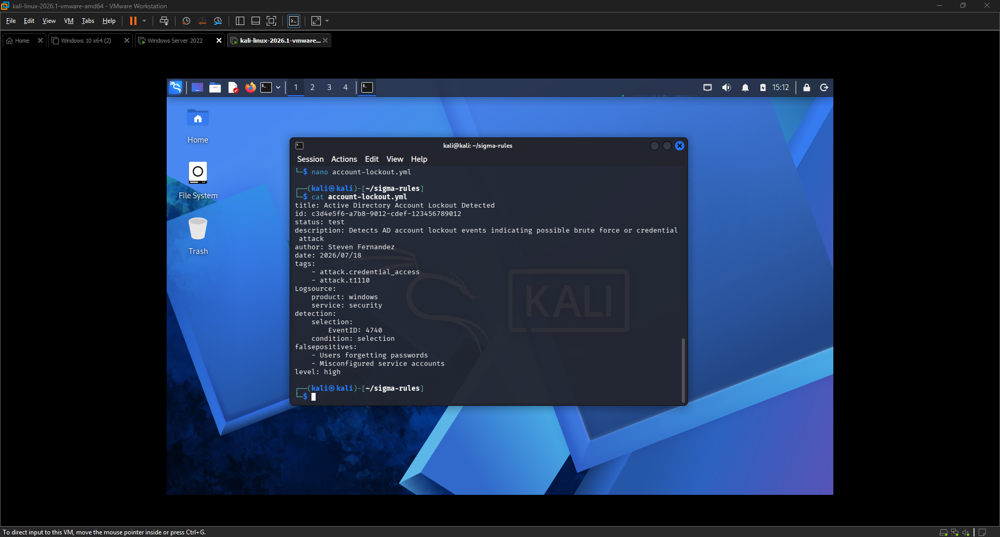
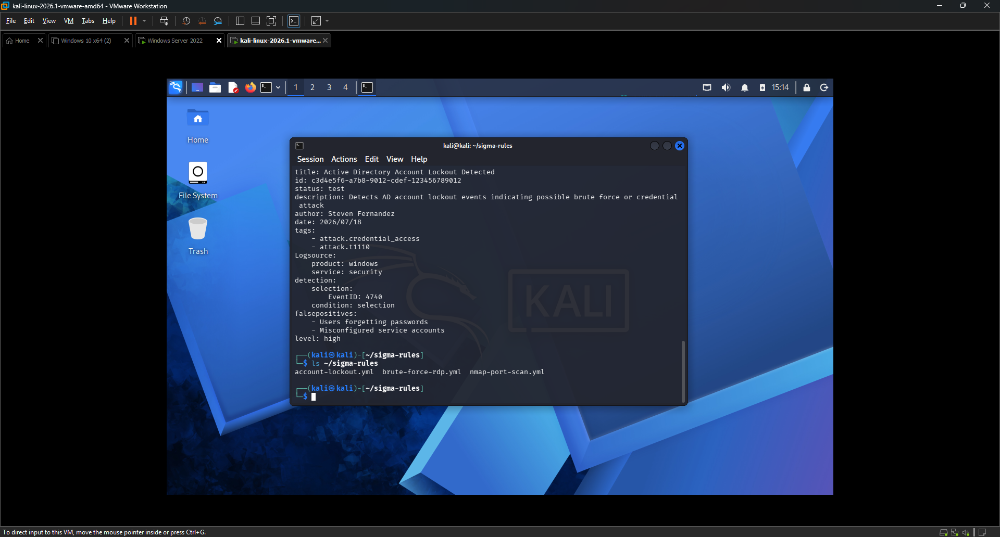
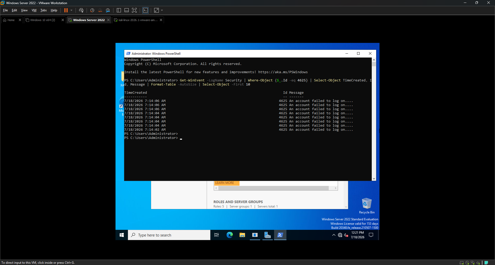
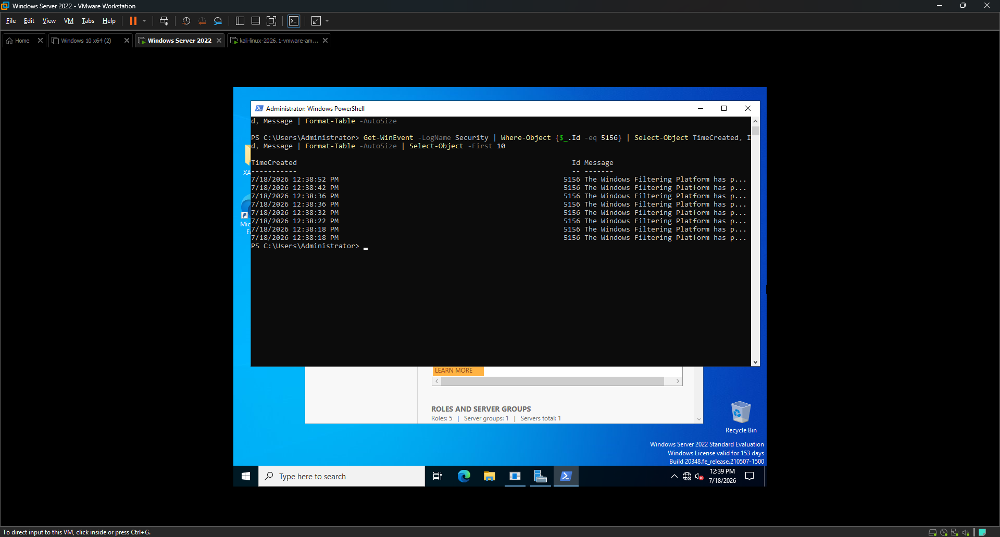

<div align="center">

# 📐 EXERCISE 07 — SIGMAHQ DETECTION RULES


</div>

---

[← Back to README](README.md)

---

## 🖥️ Lab Environment

| Component | Details |
|-----------|---------|
| Rule Writing Platform | Kali Linux 2026.1 |
| Rule Format | Sigma YAML |
| Validation Platform | Windows Server 2022 PowerShell |
| Log Source | Windows Security Event Log |
| Rules Written | 3 |
| Events Validated | 4625, 5156, 4740 |

---

## 📋 Background

Sigma is an open and vendor-neutral detection rule format used by security engineers and threat hunters to write detection logic that can be converted to work with any SIEM — Splunk, Elastic, Microsoft Sentinel, Wazuh, QRadar, and more. Writing Sigma rules is a core skill for detection engineers and SOC analysts at the L2/L3 level.

In this exercise I wrote three Sigma detection rules based on the attacks documented in earlier exercises — RDP brute force (Exercise 03), network port scanning (Exercise 02), and Active Directory account lockout (Exercise 05). I then validated each rule by querying Windows Server Security Event Logs to confirm the events our rules target were actually generated by those attacks.

---

## 🎯 Lab Objectives

- Understand the Sigma rule format and YAML structure
- Write detection rules for real attacks performed in the lab
- Map rules to MITRE ATT&CK techniques
- Validate rules against actual Windows Security Event Logs
- Build a reusable detection rule library

---

## 📐 Sigma Rule Format

Every Sigma rule follows this structure:

```yaml
title: Rule name
id: Unique UUID
status: test / stable / experimental
description: What this rule detects
author: Who wrote it
date: When it was written
tags:
    - attack.tactic
    - attack.technique_id
logsource:
    product: windows / linux / etc
    service: security / sysmon / etc
detection:
    selection:
        FieldName: Value
    condition: selection
falsepositives:
    - Known benign activity
level: low / medium / high / critical
```

---

## ✍️ Rules Written

### Rule 1 — RDP Brute Force Attack

**Filename:** `brute-force-rdp.yml`

**Based on:** Exercise 03 — Hydra RDP brute force attack  
**Event detected:** Event ID 4625 — Failed logon  
**MITRE:** T1110.001 — Brute Force: Password Guessing

```yaml
title: RDP Brute Force Attack Detected
id: a1b2c3d4-e5f6-7890-abcd-ef1234567890
status: test
description: Detects multiple failed RDP logon attempts indicating a brute force attack
author: Steven Fernandez
date: 2026/07/18
tags:
    - attack.credential_access
    - attack.t1110.001
logsource:
    product: windows
    service: security
detection:
    selection:
        EventID: 4625
        LogonType: 10
    timeframe: 30s
    condition: selection | count() > 5
falsepositives:
    - Legitimate users mistyping passwords
level: high
```

**Detection logic:** Fires when more than 5 failed RDP logon attempts (LogonType 10) occur within 30 seconds from the same source — the exact pattern Hydra generated in Exercise 03.

---

### Rule 2 — Nmap Network Port Scan

**Filename:** `nmap-port-scan.yml`

**Based on:** Exercise 02 — Nmap network reconnaissance  
**Event detected:** Event ID 5156 — Windows Filtering Platform connection  
**MITRE:** T1046 — Network Service Discovery

```yaml
title: Nmap Network Port Scan Detected
id: b2c3d4e5-f6a7-8901-bcde-f12345678901
status: test
description: Detects multiple inbound connection attempts indicating a port scan
author: Steven Fernandez
date: 2026/07/18
tags:
    - attack.reconnaissance
    - attack.t1046
logsource:
    product: windows
    service: security
detection:
    selection:
        EventID: 5156
        Direction: Inbound
    condition: selection | count() > 10
    timeframe: 10s
falsepositives:
    - Network monitoring tools
    - Vulnerability scanners
level: medium
```

**Detection logic:** Fires when more than 10 inbound connection attempts are logged within 10 seconds — the signature pattern of an Nmap port scan.

---

### Rule 3 — Active Directory Account Lockout

**Filename:** `account-lockout.yml`

**Based on:** Exercise 05 — AD credential attack with netexec  
**Event detected:** Event ID 4740 — Account locked out  
**MITRE:** T1110 — Brute Force

```yaml
title: Active Directory Account Lockout Detected
id: c3d4e5f6-a7b8-9012-cdef-123456789012
status: test
description: Detects AD account lockout events indicating possible brute force or credential attack
author: Steven Fernandez
date: 2026/07/18
tags:
    - attack.credential_access
    - attack.t1110
logsource:
    product: windows
    service: security
detection:
    selection:
        EventID: 4740
    condition: selection
falsepositives:
    - Users forgetting passwords
    - Misconfigured service accounts
level: high
```

**Detection logic:** Fires on any Event ID 4740 — every account lockout should be investigated as it may indicate a credential attack in progress.

---

## 🔍 Rule Validation

I validated each rule by querying the Windows Server Security Event Log using PowerShell to confirm the events our rules target were actually generated by the attacks in previous exercises.

### Validation 1 — Brute Force Rule (Event ID 4625)

```powershell
Get-WinEvent -LogName Security | Where-Object {$_.Id -eq 4625} | Select-Object TimeCreated, Id, Message | Format-Table -AutoSize | Select-Object -First 10
```

**Result:** Multiple Event ID 4625 entries confirmed — timestamps matching the Hydra attack from Exercise 03. Our brute force rule would have fired within the first 30 seconds of the attack.

---

### Validation 2 — Port Scan Rule (Event ID 5156)

```powershell
Get-WinEvent -LogName Security -MaxEvents 1000 | Where-Object {$_.Id -eq 5156} | Select-Object TimeCreated, Id, Message | Format-Table -AutoSize | Select-Object -First 10
```

**Result:** Multiple Event ID 5156 entries confirmed — inbound connection events from 192.168.10.101 matching the Nmap scan from Exercise 02. Our port scan rule would have fired within 10 seconds of the scan starting.

---

### Validation 3 — Account Lockout Rule (Event ID 4740)

Event ID 4740 events were previously documented in Exercise 05 — the netexec credential attack locked the `jsmith` account and generated 4740 events logged at 7/17/2026 5:51 AM. Our account lockout rule would have fired immediately on the first lockout event.

---

## 📊 Rule Summary

| Rule | File | Event ID | MITRE | Level | Validated |
|------|------|----------|-------|-------|-----------|
| RDP Brute Force | brute-force-rdp.yml | 4625 | T1110.001 | High | ✅ |
| Port Scan | nmap-port-scan.yml | 5156 | T1046 | Medium | ✅ |
| Account Lockout | account-lockout.yml | 4740 | T1110 | High | ✅ |

---

## ✅ Result

I successfully wrote three Sigma detection rules covering the three main attack techniques used in this lab — brute force, network reconnaissance, and credential attacks. Each rule was validated against actual Windows Security Event Logs confirming the events our rules target were generated by the attacks. These rules can be exported and imported into any compatible SIEM including Wazuh, Splunk, Microsoft Sentinel, and Elastic.

---

## 💡 Key Takeaways

- Sigma rules are vendor neutral — write once, deploy anywhere
- Detection rules should always be tied to specific MITRE ATT&CK techniques — this gives analysts context about what the attacker is trying to do
- Every rule needs a false positive section — rules that fire too often get ignored
- The best detection rules come from understanding attacks you have actually performed and observed
- Timeframe conditions (count > X within Y seconds) dramatically reduce false positives compared to single-event rules
- Account lockout (4740) should always be a high severity alert — it means the lockout policy already stopped an attack

---

## 📟 Commands Reference

| Command | Purpose |
|---------|---------|
| `mkdir ~/sigma-rules` | Create rules directory |
| `nano brute-force-rdp.yml` | Create brute force rule |
| `nano nmap-port-scan.yml` | Create port scan rule |
| `nano account-lockout.yml` | Create account lockout rule |
| `cat <filename>` | Verify rule contents |
| `ls ~/sigma-rules` | List all rules |
| `Get-WinEvent -LogName Security \| Where-Object {$_.Id -eq 4625}` | Validate brute force rule |
| `Get-WinEvent -LogName Security \| Where-Object {$_.Id -eq 5156}` | Validate port scan rule |

---

## 📸 Screenshots

| Screenshot | Description |
|------------|-------------|
|  | brute-force-rdp.yml rule contents |
|  | nmap-port-scan.yml rule contents |
|  | account-lockout.yml rule contents |
|  | ls showing all three rule files in sigma-rules directory |
|  | PowerShell output showing Event ID 4625 events — brute force rule validated |
|  | PowerShell output showing Event ID 5156 events — port scan rule validated |
