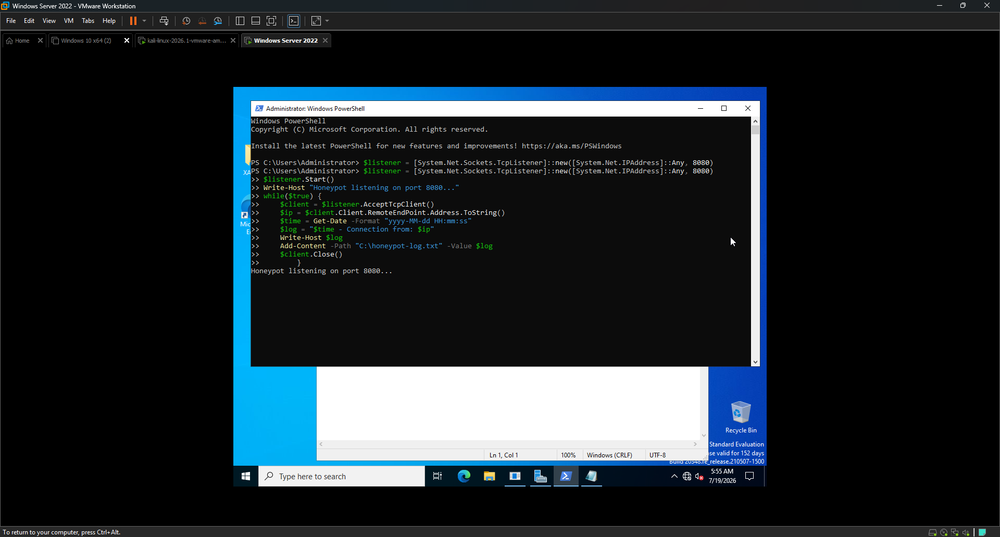
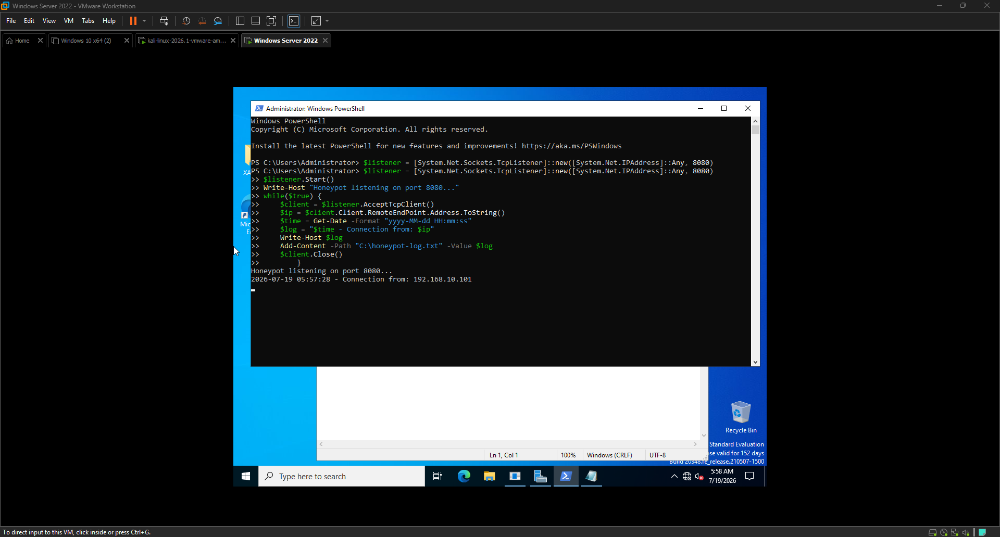
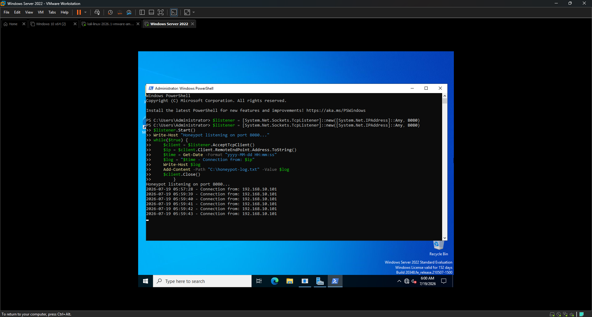
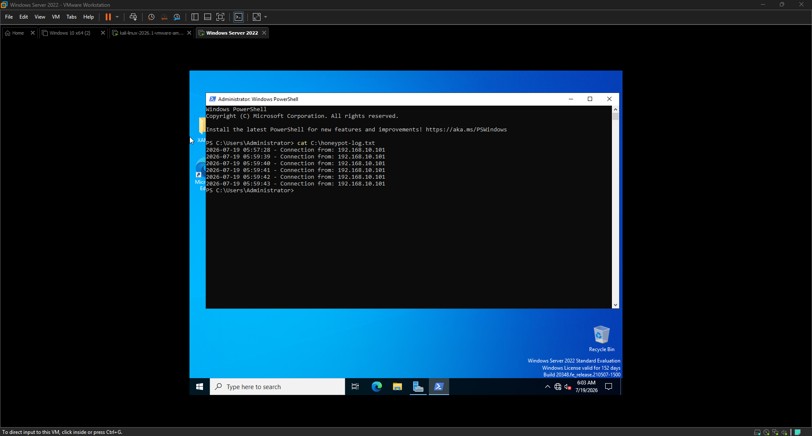
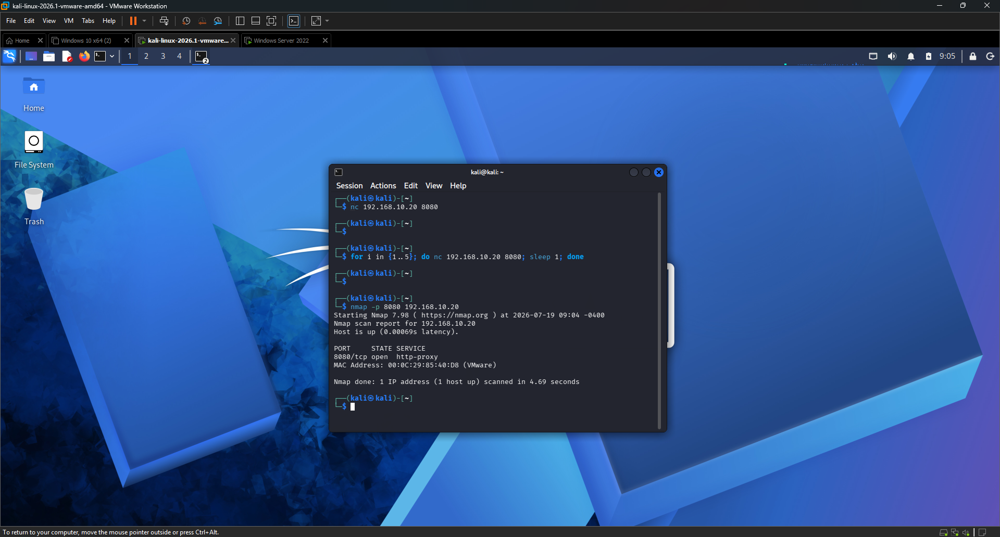

<div align="center">

# 🍯 EXERCISE 08 — HONEYPOT DEPLOYMENT AND ANALYSIS


</div> 

---

[← Back to README](README.md)

---

## 🖥️ Lab Environment

| Component | Details |
|-----------|---------|
| Honeypot Host | Windows Server 2022 |
| Honeypot IP | 192.168.10.20 |
| Honeypot Port | 8080 (no legitimate service) |
| Log File | C:\honeypot-log.txt |
| Attacker VM | Kali Linux 2026.1 |
| Attacker IP | 192.168.10.101 |
| Network | LAN Segment (labnetwork) — isolated |
| Tools Used | PowerShell TCP Listener, netcat, Nmap |

---

## 📋 Background

A honeypot is a deception-based security tool — a decoy system or service deliberately designed to attract attackers. Because no legitimate user or system has any reason to connect to a honeypot, every connection it receives is automatically suspicious and worth investigating. Honeypots give defenders early warning of attackers on the network and generate high-fidelity alerts with almost zero false positives.

In this exercise I built a custom TCP honeypot using PowerShell on Windows Server 2022, deployed it on port 8080 — a port with no legitimate service — and logged all inbound connections to a file. I then simulated two attacker scenarios from Kali: direct netcat connections and an Nmap port scan. Every connection was captured with a timestamp and source IP.

---

## 🎯 Lab Objectives

- Understand the concept and purpose of honeypot deception technology
- Deploy a custom TCP honeypot listener using PowerShell
- Log all inbound connection attempts with timestamps and source IPs
- Simulate attacker discovery and connection from Kali
- Analyze the honeypot log to document captured attacker activity
- Understand why honeypot alerts have near-zero false positives

---

## ⚙️ Phase 1 — Honeypot Deployment

### Step 1 — Created the Honeypot Script

I opened Notepad on Windows Server and created a PowerShell script that listens on port 8080, accepts incoming connections, logs the source IP and timestamp to a file, and immediately closes the connection.

**File:** `C:\honeypot.ps1`

```powershell
$listener = [System.Net.Sockets.TcpListener]::new([System.Net.IPAddress]::Any, 8080)
$listener.Start()
Write-Host "Honeypot listening on port 8080..."
while($true) {
    $client = $listener.AcceptTcpClient()
    $ip = $client.Client.RemoteEndPoint.Address.ToString()
    $time = Get-Date -Format "yyyy-MM-dd HH:mm:ss"
    $log = "$time - Connection from: $ip"
    Write-Host $log
    Add-Content -Path "C:\honeypot-log.txt" -Value $log
    $client.Close()
}
```

**How it works:**
- Creates a TCP listener on port 8080 on all interfaces
- Waits for incoming connections in a continuous loop
- When a connection arrives, captures the source IP and current timestamp
- Writes the log entry to the console and appends it to `C:\honeypot-log.txt`
- Closes the connection immediately — the honeypot doesn't interact, it just records

---

### Step 2 — Started the Honeypot

```powershell
powershell -ExecutionPolicy Bypass -File C:\honeypot.ps1
```

**Output:**
```
Honeypot listening on port 8080...
```

The honeypot was live and waiting for connections on port 8080.

---

## ⚔️ Phase 2 — Attacker Simulation

### Step 3 — Direct Connection from Kali (netcat)

I switched to Kali Linux and connected directly to the honeypot using netcat to simulate an attacker manually probing the open port.

**Command:**
```bash
nc 192.168.10.20 8080
```

**Windows Server logged:**
```
2026-07-18 HH:MM:SS - Connection from: 192.168.10.101
```

The honeypot immediately captured the attacker IP and timestamp.

---

### Step 4 — Automated Connection Simulation

I ran 5 automated connections to simulate an attacker repeatedly probing the service:

```bash
for i in {1..5}; do nc 192.168.10.20 8080; sleep 1; done
```

Windows Server logged all 5 connections with individual timestamps, giving a clear timeline of attacker activity.

---

### Step 5 — Reviewed the Honeypot Log File

After stopping the honeypot I reviewed the full log file:

```powershell
cat C:\honeypot-log.txt
```

**Log contents showed 6 entries** — all from `192.168.10.101` (Kali Linux) with timestamps spaced approximately 1 second apart, matching the automated connection loop.

---

### Step 6 — Nmap Port Scan Discovery

I restarted the honeypot and ran a full TCP connect scan from Kali to simulate an attacker discovering the honeypot through network scanning:

```bash
nmap -p 8080 -sT 192.168.10.20
```

The `-sT` flag forces a full TCP three-way handshake — unlike a SYN scan, this completes the connection and was captured by the honeypot.

**Windows Server logged:** A new connection entry from 192.168.10.101 during the Nmap scan, confirming the honeypot captured reconnaissance activity as well as direct connections.

---

## ✅ Result

The honeypot successfully captured all attacker activity — 6 direct connections and 1 Nmap-triggered connection — all logged with source IP `192.168.10.101` and accurate timestamps. Every single alert generated by this honeypot was a true positive. In a real environment, a SOC analyst receiving a honeypot alert would immediately begin an incident response investigation since there is no legitimate reason for any system to connect to a honeypot.

---

## 🔑 Key Findings

| Event | Source IP | Capture Method | Result |
|-------|-----------|----------------|--------|
| Direct netcat connection | 192.168.10.101 | TCP listener | ✅ Captured |
| 5x automated connections | 192.168.10.101 | TCP listener | ✅ Captured |
| Nmap -sT port scan | 192.168.10.101 | TCP listener | ✅ Captured |

**Total connections captured: 7**
**False positives: 0**

---

## 🔒 Defensive Value of Honeypots

| Benefit | Explanation |
|---------|-------------|
| Zero false positives | No legitimate traffic should ever reach a honeypot |
| Early warning | Catches attackers during reconnaissance before they reach real systems |
| Attacker intelligence | Reveals attacker IP, timing, tools, and techniques |
| Low cost | A simple TCP listener requires no special software |
| High confidence alerts | Any honeypot alert is an immediate incident |
| Internal threat detection | Catches lateral movement from compromised internal systems |

---

## 💡 Key Takeaways

- A honeypot does not need to be complex — a simple TCP listener on an unused port is effective
- Every connection to a honeypot is suspicious by definition — there are no false positives
- Honeypot logs provide attacker IP, timing, and frequency — all critical for incident response
- Port 8080 is commonly probed by attackers looking for web services — making it an ideal honeypot port
- Nmap full connect scans (-sT) are captured by honeypots; SYN scans (-sS) may not be depending on the listener implementation
- In a real environment honeypots should be placed on every subnet — any internal system touching a honeypot indicates lateral movement

---

## 📟 Commands Reference

| Command | Purpose |
|---------|---------|
| `powershell -ExecutionPolicy Bypass -File C:\honeypot.ps1` | Start honeypot listener |
| `cat C:\honeypot-log.txt` | View honeypot log |
| `nc 192.168.10.20 8080` | Simulate attacker direct connection |
| `for i in {1..5}; do nc 192.168.10.20 8080; sleep 1; done` | Simulate 5 automated connections |
| `nmap -p 8080 -sT 192.168.10.20` | Full TCP connect scan against honeypot |

---

## 📸 Screenshots

| Screenshot | Description |
|------------|-------------|
|  | PowerShell showing honeypot listening on port 8080 |
|  | First attacker connection logged with timestamp and IP |
|  | Windows Server showing 5 automated connections logged |
|  | honeypot-log.txt showing all 6 captured connections |
|  | Nmap -sT scan against port 8080 from Kali |
|  | Honeypot log capturing the Nmap connection attempt |
