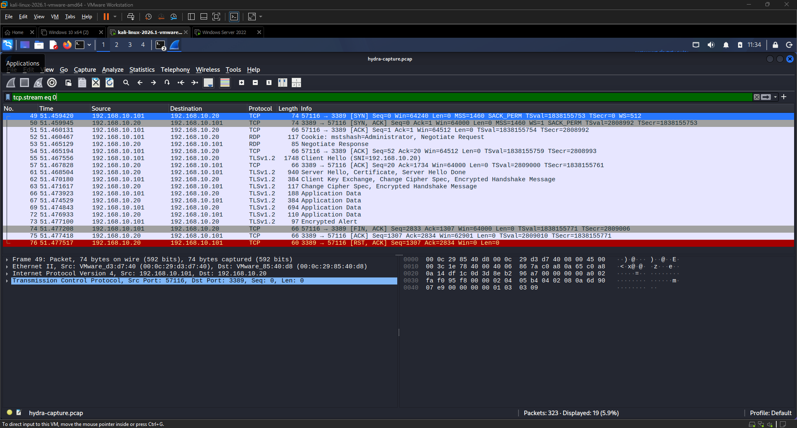
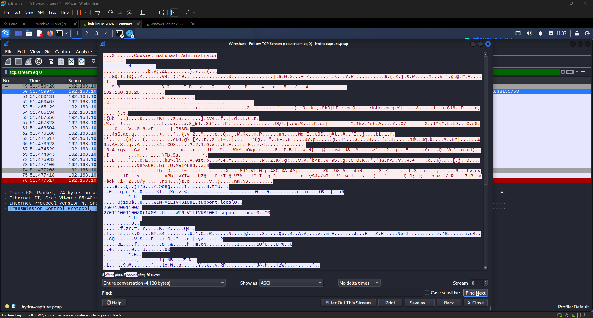
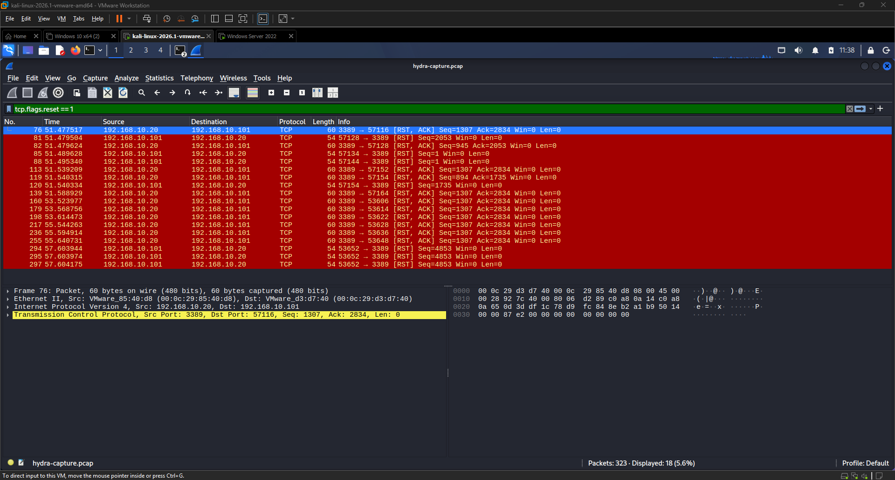
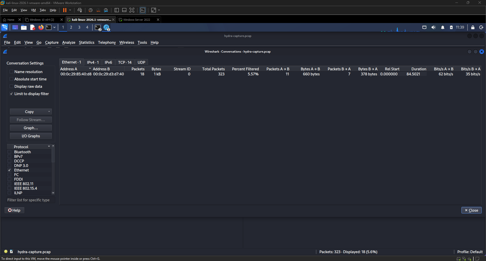
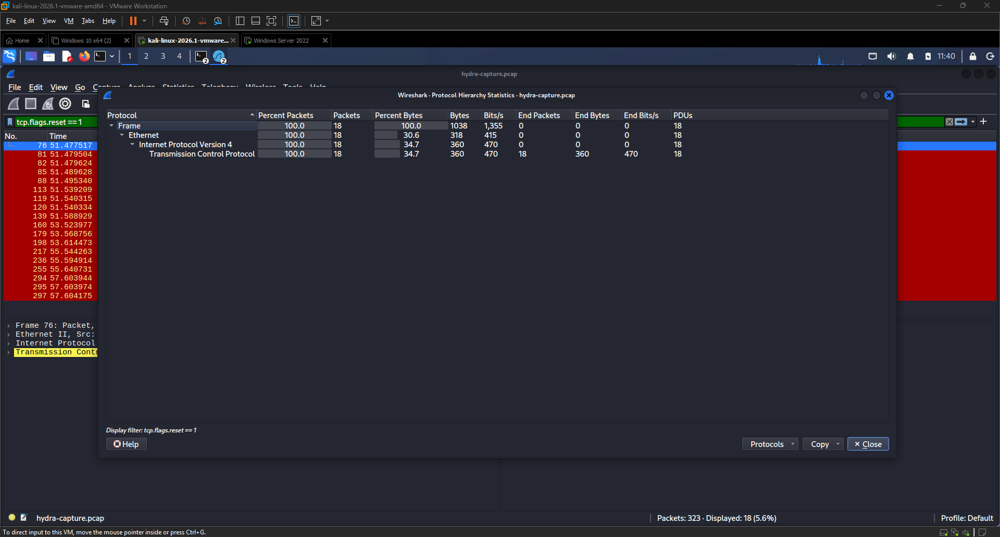
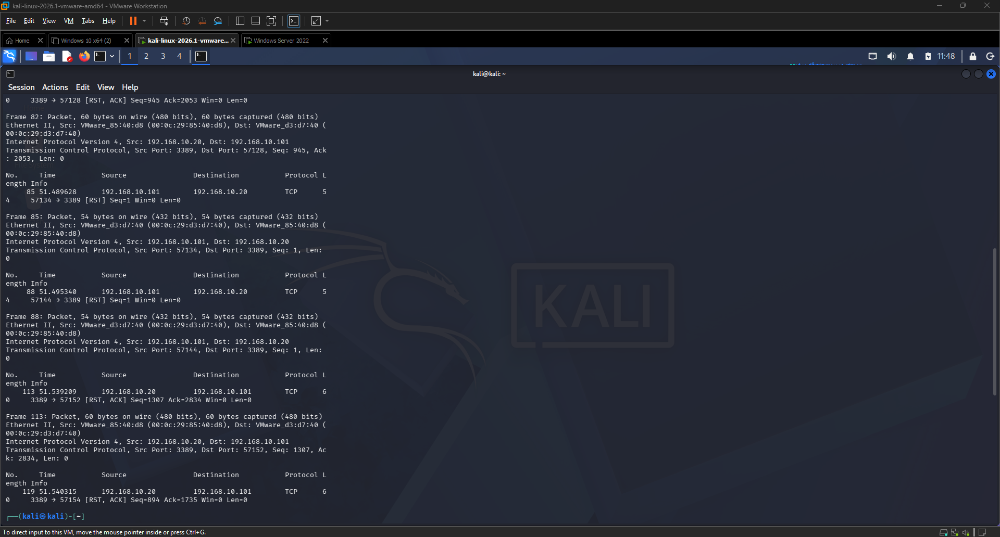
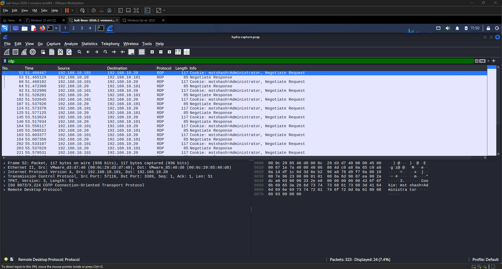

<div align="center">

# 🔬 EXERCISE 09 — PCAP ANALYSIS


</div>

---

[← Back to README](README.md)

---

## 🖥️ Lab Environment

| Component | Details |
|-----------|---------|
| Analysis Platform | Kali Linux 2026.1 |
| Tool | Wireshark |
| PCAP File | hydra-capture.pcap (from Exercise 04) |
| Total Packets | 323 |
| Attacker IP | 192.168.10.101 |
| Target IP | 192.168.10.20 |
| Attack Captured | Hydra RDP Brute Force (Exercise 03) |

---

## 📋 Background

PCAP (Packet Capture) analysis is one of the most important skills in incident response and threat hunting. When an attack occurs, the network traffic is the ground truth — it shows exactly what happened, when it happened, and how. Unlike logs which can be deleted or tampered with, a PCAP file captures raw network packets that can be analyzed forensically long after an attack.

In this exercise I performed a deep forensic analysis of `hydra-capture.pcap` — the packet capture taken during the Hydra RDP brute force attack in Exercise 04. While Exercise 04 introduced basic Wireshark filtering, this exercise goes deeper into forensic techniques used by SOC analysts and incident responders to reconstruct an attack from network evidence.

---

## 🎯 Lab Objectives

- Perform deep forensic PCAP analysis using Wireshark
- Isolate and follow individual TCP conversations
- Identify TCP reset patterns characteristic of brute force tools
- Use Wireshark statistics to build an attack summary
- Analyze protocol hierarchy to understand attacker tooling
- Export packet dissections for documentation
- Build a complete attack timeline from network evidence alone

---

## 🔬 Analysis Phases

### Phase 1 — TCP Stream Isolation

I applied a stream filter to isolate the first complete TCP conversation between Kali and Windows Server.

**Filter:**
```
tcp.stream eq 0
```

**What this shows:** The very first connection Hydra made to port 3389. Each `tcp.stream` number represents a separate TCP conversation — Hydra opened a new stream for every password attempt, which is why the stream numbers increment rapidly throughout the capture.

---

### Phase 2 — Follow TCP Stream

I right-clicked a packet and selected **Follow → TCP Stream** to read the raw data exchanged during the connection.

**What this shows:** The actual bytes exchanged between Kali and Windows Server during the RDP negotiation. Even though the traffic is partially encrypted with TLS, the initial RDP handshake is visible — showing Hydra attempting to establish an RDP session before submitting credentials.

This technique is used in incident response to reconstruct exactly what an attacker sent and received during a connection.

---

### Phase 3 — TCP Reset Analysis

I filtered for all TCP RST (reset) packets originating from the attacker:

**Filter:**
```
tcp.flags.reset == 1
```

**What this shows:** Every time Hydra failed a password attempt it sent or received a TCP RST to terminate the connection before starting a new one. The pattern of rapid RST packets followed immediately by new SYN packets is the network signature of a brute force tool — it's unmistakable in a PCAP and would trigger any network-based IDS rule looking for this behavior.

---

### Phase 4 — Conversation Statistics

I opened **Statistics → Conversations** and reviewed the TCP tab.

**What this shows:** A summary of the full conversation between 192.168.10.101 and 192.168.10.20 — total packets exchanged, bytes transferred, duration of the attack, and the number of separate TCP streams. This gives a high-level view of the attack scope in seconds.

In a real investigation this is one of the first places an analyst looks — it immediately shows which two IPs were talking, how much data moved, and how long the conversation lasted.

---

### Phase 5 — Protocol Hierarchy

I opened **Statistics → Protocol Hierarchy** to see the breakdown of all protocols in the capture.

**What this shows:** The percentage breakdown of traffic by protocol — TCP, RDP, TLSv1.2, DNS, ICMP. The dominance of RDP traffic (76.5% in Exercise 04) immediately tells an analyst what the attacker was targeting. Protocol hierarchy is used to quickly fingerprint what kind of attack occurred before diving into individual packets.

---

### Phase 6 — Exported Packet Dissection

I exported the full packet analysis to a text file for documentation:

**File → Export Packet Dissections → As Plain Text**

**Saved as:** `/home/kali/hydra-analysis.txt`

**Viewed with:**
```bash
head -50 /home/kali/hydra-analysis.txt
```

**What this shows:** A human-readable summary of every packet in the capture — frame numbers, timestamps, source and destination IPs, protocols, and packet details. This file can be shared with other analysts or attached to an incident report as supporting evidence.

---

### Phase 7 — RDP Attack Timeline

I applied a final filter to isolate only RDP protocol packets:

**Filter:**
```
rdp
```

**What this shows:** A clean view of only the RDP-layer traffic — the actual Remote Desktop Protocol packets exchanged during Hydra's brute force attempts. This builds the clearest attack timeline showing exactly when each RDP session was initiated, what was negotiated, and when the connection terminated.

---

## ✅ Result

I successfully performed a full forensic PCAP analysis of the Hydra brute force capture, using seven different Wireshark techniques to reconstruct the complete attack from network evidence. The analysis confirmed the attacker IP, the attack tool signature (rapid TCP resets followed by new connections), the target protocol (RDP on port 3389), and the full attack timeline. This is the exact workflow a SOC analyst or incident responder follows when analyzing a suspected brute force attack from network captures.

---

## 📊 Attack Reconstruction Summary

| Evidence | Finding |
|----------|---------|
| Attacker IP | 192.168.10.101 (Kali Linux) |
| Target IP | 192.168.10.20 (Windows Server) |
| Target Port | 3389 (RDP) |
| Attack Tool Signature | Rapid TCP RST packets followed immediately by new SYN — characteristic of Hydra |
| Total Packets | 323 |
| RDP Packets | 247 (76.5% of capture) |
| TCP Streams | 14 separate connections |
| Attack Duration | ~30 seconds |
| Protocol Mix | TCP, RDP, TLSv1.2, DNS, ICMP |

---

## 💡 Key Takeaways

- PCAP analysis is forensic ground truth — raw packets cannot be edited or deleted like logs can
- TCP RST patterns are the network signature of brute force tools — any IDS monitoring for rapid RST-SYN sequences would have caught this immediately
- Following TCP streams reconstructs individual conversations — critical for understanding exactly what an attacker did
- Protocol hierarchy immediately fingerprints the attack type — RDP-heavy traffic with rapid resets screams brute force
- Exporting packet dissections creates shareable evidence for incident reports and legal proceedings
- PCAP analysis combined with log analysis (Exercise 02-05) gives a complete picture of an attack from two independent evidence sources
- A 30-second brute force attack generates 323 packets — more than enough evidence to reconstruct the full timeline

---

## 📟 Commands and Filters Reference

| Filter / Command | Purpose |
|-----------------|---------|
| `tcp.stream eq 0` | Isolate first TCP conversation |
| `tcp.flags.reset == 1` | Show all TCP reset packets |
| `rdp` | Show only RDP protocol packets |
| `tcp.flags.syn == 1 && ip.src == 192.168.10.101` | Show attacker SYN packets |
| `tcp.port == 3389` | Show all RDP port traffic |
| Follow → TCP Stream | Read raw conversation data |
| Statistics → Conversations | Attack scope summary |
| Statistics → Protocol Hierarchy | Protocol breakdown |
| File → Export Packet Dissections | Export to text for documentation |
| `head -50 /home/kali/hydra-analysis.txt` | View exported analysis |

---

## 📸 Screenshots

| Screenshot | Description |
|------------|-------------|
|  | Wireshark filtered to tcp.stream eq 0 — first TCP conversation |
|  | Follow TCP Stream window showing raw RDP handshake data |
|  | TCP reset packets filtered — brute force tool signature |
|  | Conversations window showing full attack traffic summary |
|  | Protocol Hierarchy showing RDP dominance in capture |
|  | Exported hydra-analysis.txt packet dissection output |
|  | RDP filter showing clean attack timeline |
