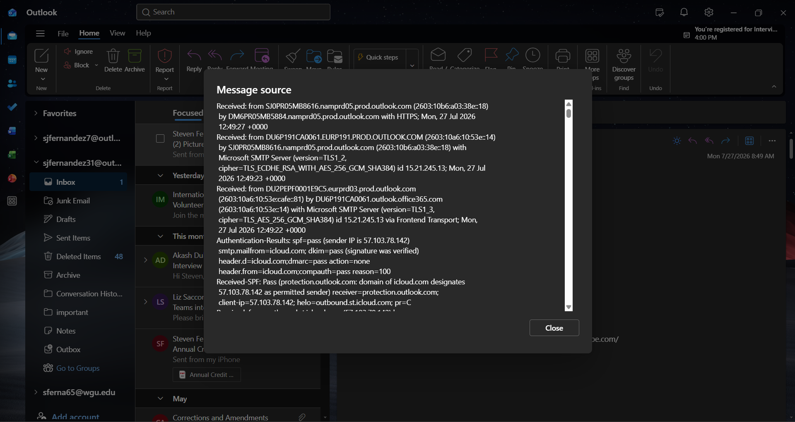
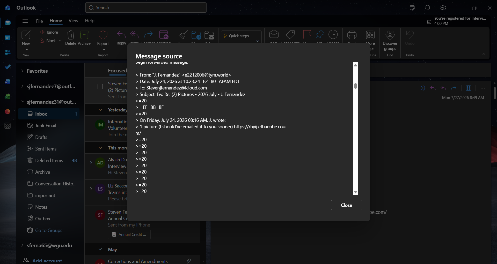
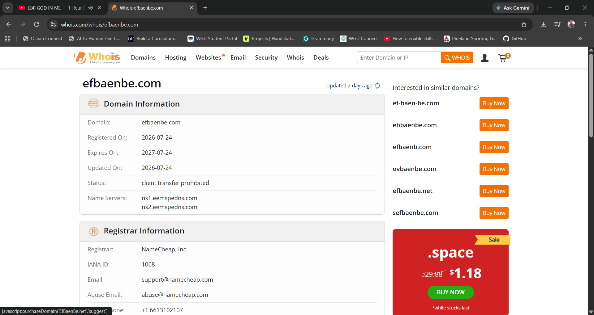
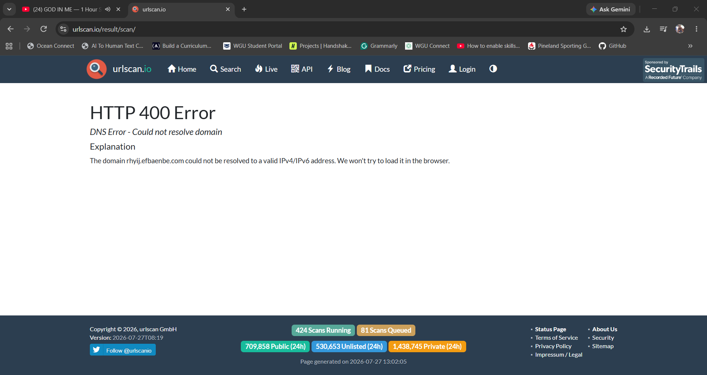

# 🔍 EXERCISE 11 — PHISHING EMAIL ANALYSIS

---

[← Back to README](README.md)

---

## 🖥️ Lab Environment

| Component | Details |
|---|---|
| Mail Client | Outlook Web, sjfernandez31 account |
| Analysis Tools | Outlook Message Source viewer, whois.com, urlscan.io |
| Sample Type | Real phishing email received in personal inbox |

## 📋 Background

For this exercise, I analyzed a real phishing email that landed in my own inbox rather than a synthetic sample, since I wanted the exercise to reflect an actual live threat instead of a controlled one. The email arrived with a forwarded photo sharing lure, a common pretext used to get a target to click a link without thinking twice. Because the message had already passed through a forward, I could not recover the original sender's raw SMTP headers directly, so I adapted the analysis to work with what was available, which turned out to still be a very complete picture of the threat.

## 🎯 Lab Objectives

- Identify sender spoofing by comparing display name against the actual originating address
- Establish a legitimate authentication baseline for comparison using SPF, DKIM, and DMARC results
- Investigate the embedded link's domain using WHOIS registration data
- Attempt to sandbox the malicious link using urlscan.io
- Document indicators of a disposable phishing infrastructure

## ⚙️ Phase 1 — Sender and Header Review

### Step 1 — Reviewing the message source

I opened the message in Outlook and used the Message Source viewer to inspect the raw headers. Since the phishing email had originally been forwarded to myself between accounts, this view showed the SMTP path and authentication results for that forward rather than the original phishing send. The Authentication Results line showed spf=pass, dkim=pass, and dmarc=pass, all tied to my own icloud.com sending domain, confirming this particular header block belonged to a clean, self initiated forward rather than the attacker's infrastructure.

### Step 2 — Locating the original message inside the forward

Scrolling further down in the message source, I found the original phishing content quoted inline, complete with quoted printable line wrap artifacts such as stray equals signs and greater than symbols. This confirmed that the original email had been forwarded as quoted text rather than as an attachment, which meant the true originating headers, including its own SPF, DKIM, and DMARC results, had been stripped out during the forward and were not recoverable through this method. I noted the sender was displayed as J. Fernandez but the underlying address was e2212006@tym.world, a domain with no connection to the actual sender it was impersonating.

## ⚙️ Phase 2 — Domain and Link Investigation

### Step 1 — WHOIS lookup

I ran a WHOIS lookup on efbaenbe.com, the base domain hosting the embedded link. The results showed the domain was registered on 2026 07 24, the same day the phishing email itself was sent, with an expiration date exactly one year later and NameCheap listed as the registrar. Same day registration paired with immediate use in a phishing campaign is a strong indicator of disposable attacker infrastructure, since legitimate businesses do not typically register a domain and begin sending unsolicited links from it within hours.

### Step 2 — Attempted sandbox scan

I submitted the full link, https://rhyij.efbaenbe.com/, to urlscan.io. The scan returned an HTTP 400 DNS error stating the domain could not be resolved to a valid IPv4 or IPv6 address. Rather than treating this as a failed step, I documented it as a finding in its own right, since it indicates the subdomain infrastructure had already been taken offline or rotated out by the time of analysis, consistent with short lived phishing infrastructure designed to evade detection tools and blocklists shortly after a campaign goes out.

## ✅ Result

The email was confirmed as a phishing attempt using sender display name spoofing, a nested fake forward chain to add false legitimacy, and a same day registered disposable domain to host the malicious link. Full SPF, DKIM, and DMARC results for the original sender could not be obtained since the message had been forwarded as quoted text rather than preserved as raw headers, a real and common limitation in phishing analysis of forwarded mail. The WHOIS registration date and the failed DNS resolution together provided strong independent confirmation that this was disposable attacker infrastructure rather than a legitimate sender.

## 💡 Key Takeaways

- Forwarded emails often strip the original SMTP headers, so authentication results from a forward only confirm the forwarder's domain, not the original sender's
- A domain registered the same day it is used to send phishing links is a strong red flag on its own
- A DNS resolution failure during sandboxing is still a valid and documentable finding, since it points to short lived, rotated, or already burned infrastructure
- Display name spoofing remains one of the simplest and most effective social engineering techniques, since most mail clients show the display name prominently and the real address only on closer inspection

## 📟 Commands Reference

| Action | Tool or Method | Purpose |
|---|---|---|
| View raw headers | Outlook Message Source | Inspect SMTP path and authentication results |
| Domain registration lookup | whois.com | Determine domain age and registrar |
| Link sandboxing | urlscan.io | Attempt to resolve and analyze the link safely without visiting it directly |

## 📸 Screenshots

| Screenshot | Description |
|------------|--------------|
|  | Message source showing the forward's clean SPF, DKIM, and DMARC pass results |
|  | Quoted original phishing message embedded in the forward, showing the spoofed sender address |
|  | WHOIS lookup showing efbaenbe.com registered the same day the phishing email was sent |
|  | urlscan.io DNS resolution error confirming the link's infrastructure was no longer active |
