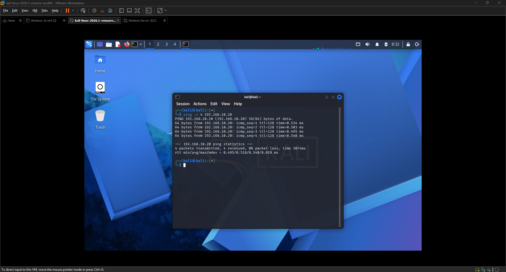
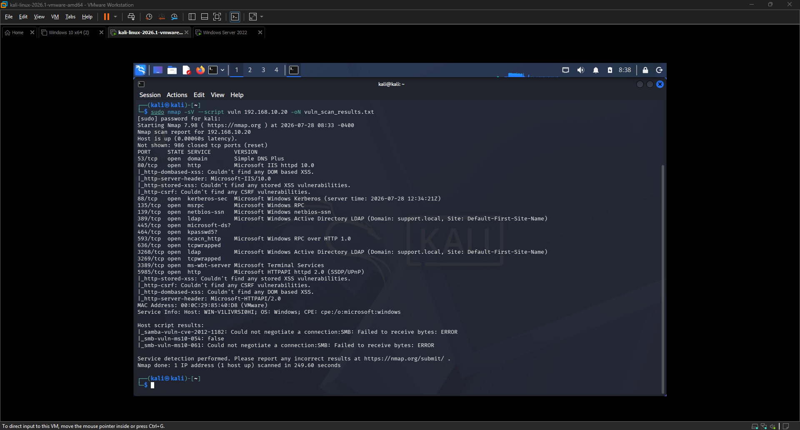
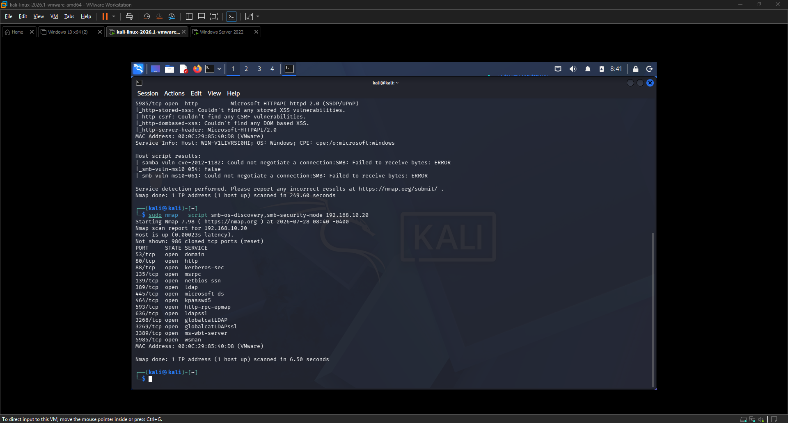

<div align="center">

# 🔍 EXERCISE 12 — VULNERABILITY SCAN AND REPORT


</div>

---

[← Back to README](README.md)

---

## 🖥️ Lab Environment

| Component | Details |
|---|---|
| Attacker VM | Kali Linux 2026.1, 192.168.10.101 |
| Target VM | Windows Server 2022 Standard, 192.168.10.20, domain support.local |
| Network | LAN Segment (labnetwork), isolated, no internet access |
| Tool | Nmap 7.98 with the Nmap Scripting Engine (NSE) |

## 📋 Background

For this exercise, I ran a vulnerability scan against my Windows Server 2022 domain controller using Nmap's scripting engine instead of a dedicated vulnerability scanner like OpenVAS, since it required no extra setup and could still surface real, documentable findings. I wanted to know both what services were exposed on the server and whether any of them carried known, testable weaknesses.

## 🎯 Lab Objectives

- Enumerate open ports and running services on the target server
- Run automated vulnerability detection scripts against those services
- Investigate the results of the SMB related vulnerability checks in more depth
- Document findings, including confirmed hardened areas, in a professional report format

## ⚙️ Phase 1 — Service and Vulnerability Scan

### Step 1 — Confirming connectivity

Before scanning, I confirmed the attacker and target VMs could reach each other on the isolated lab network with a basic ping test from Kali to the Windows Server VM. All four packets were transmitted and received with no loss, confirming the network path was working before running any scans.

### Step 2 — Running the full vulnerability scan

I ran the following command from Kali against the Windows Server target.

```
sudo nmap -sV --script vuln 192.168.10.20 -oN vuln_scan_results.txt
```

This performs service version detection and then runs Nmap's full vuln script category against every open port found. The scan took about four minutes to complete since it was testing multiple ports against several vulnerability scripts.

The scan identified 14 open ports, including DNS, HTTP, Kerberos, RPC, NetBIOS, LDAP, SMB, RPC over HTTP, LDAPS, Remote Desktop, and WinRM over HTTPS, which is the expected footprint for an Active Directory domain controller. The HTTP based scripts found no stored XSS, DOM based XSS, or CSRF vulnerabilities on either the IIS service on port 80 or the HTTPAPI service on port 5985.

The three SMB targeted vulnerability checks, samba-vuln-cve-2012-1182, smb-vuln-ms10-054, and smb-vuln-ms10-061, all either failed to negotiate a connection or returned false, meaning none of these older, well known SMB vulnerabilities from 2010 to 2012 were present or exploitable on this server.

## ⚙️ Phase 2 — SMB Hardening Follow Up

### Step 1 — Targeted SMB checks

Since the vuln scan's SMB probes failed to connect, I ran a second, more targeted scan to investigate further.

```
sudo nmap --script smb-os-discovery,smb-security-mode 192.168.10.20
```

This scan completed in about six seconds and returned the same 14 open ports, but neither the smb-os-discovery nor smb-security-mode scripts returned any additional operating system or SMB signing information. Both scripts attempt to pull this data through an unauthenticated, anonymous SMB connection, so returning nothing indicates the server is not exposing that information to unauthenticated probes.

## ✅ Result

The scan found no exploitable legacy vulnerabilities and no unauthenticated information disclosure through SMB. The open ports on the server are consistent with its expected role as an Active Directory domain controller rather than unnecessary exposed attack surface. Taken together, the failed legacy SMB vulnerability probes and the empty results from the unauthenticated OS discovery and security mode checks point to a server that is properly hardened against the specific vulnerabilities and enumeration techniques tested in this exercise.

## 💡 Key Takeaways

- A vulnerability scan returning no exploitable findings is still a valid and valuable result, since proving a system is hardened against known threats is as important as finding a weakness
- Nmap NSE vulnerability scripts targeting old CVEs failing to connect can itself be a sign of modern security controls, such as required SMB signing, blocking the legacy probe method entirely
- Unauthenticated or null session SMB enumeration returning no data is a good hardening indicator, since it shows the server is not leaking OS or configuration details to anonymous connections
- The open port footprint of a domain controller will always look large compared to a typical server, so context matters when evaluating whether exposed services are a real risk

## 📟 Commands Reference

| Command | Purpose |
|---|---|
| `ping -c 4 192.168.10.20` | Confirm network connectivity to the target before scanning |
| `sudo nmap -sV --script vuln 192.168.10.20 -oN vuln_scan_results.txt` | Detect service versions and run the full NSE vulnerability script category |
| `sudo nmap --script smb-os-discovery,smb-security-mode 192.168.10.20` | Targeted follow up check on SMB OS disclosure and signing configuration |

## 📸 Screenshots

| Screenshot | Description |
|------------|--------------|
|  | Successful ping test confirming connectivity between Kali and Windows Server |
|  | Full Nmap vuln script scan results showing open ports and SMB vulnerability check outcomes |
|  | Targeted smb-os-discovery and smb-security-mode scan showing no unauthenticated data disclosure |
